<p align="center">
  <picture>
    <source media="(prefers-color-scheme: dark)" srcset="docs/brand/openpump-wordmark-dark.png">
    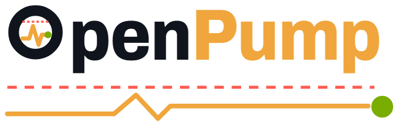
  </picture>
</p>

<h1 align="center">OpenPump</h1>

<p align="center"><b>An open-source project to help you train, track your progress,<br>and move the PE community &mdash; and your own PE journey &mdash; forward.</b></p>

<p align="center">
  <a href="LICENSE"></a>
  
  
  <a href="https://github.com/OpenByte-source/OpenPump-App/releases/latest"></a>
</p>

<p align="center">
  <a href="#what-it-is">What it is</a> &nbsp;·&nbsp;
  <a href="#what-it-looks-like">See it</a> &nbsp;·&nbsp;
  <a href="#getting-it-running">Get it</a> &nbsp;·&nbsp;
  <a href="#helping-out">Help out</a> &nbsp;·&nbsp;
  <a href="#safety">Safety</a>
</p>

<p align="center"></p>

---

## What it is

OpenPump is an Android app for Bluetooth vacuum pumps. It runs your sessions, keeps an honest record of what happened, and helps you make progress over months.

The goal is bigger than any one feature: the best app there is to pump, track your progress, and fit the way *you* train. It isn't there yet. This page tells you what works today and what doesn't.

- **Works with** the Epic Hydro PE Pump over Bluetooth. It's the one pump checked on real hardware so far. Others can be added by the people who own them.
- **No pump?** Practice mode runs everything against a simulated pump, and marks those runs as simulated.
- **Your data** stays on your phone. No account, no server, no analytics.
- **You need** Android 7.0 or newer.
- **It's free** and open source, under AGPL-3.0.

---

## Safety

> [!WARNING]
> OpenPump drives a pump that pulls a vacuum on your body. It is not a medical device and it gives no medical advice. Stop if anything hurts, goes numb or feels wrong.

The big red STOP button tells the pump to vent at once, and the app watches the pump's own readings to confirm the pressure is falling. If it can't confirm that, it says so and tells you to disconnect the tubing at the cuff. How the app keeps you safe, rule by rule, is in [SAFETY.md](SAFETY.md) if you want the detail.

Safety problems are reported privately, not as public issues. See [SECURITY.md](SECURITY.md).

---

## How it works

**1. Connect — or don't.**
The app looks for your Epic Hydro PE Pump and remembers it. No pump? Turn on the simulated pump and
everything below still works, against a model. Simulated runs are labelled everywhere and
filed as simulated, so you can't mistake one for a real session.

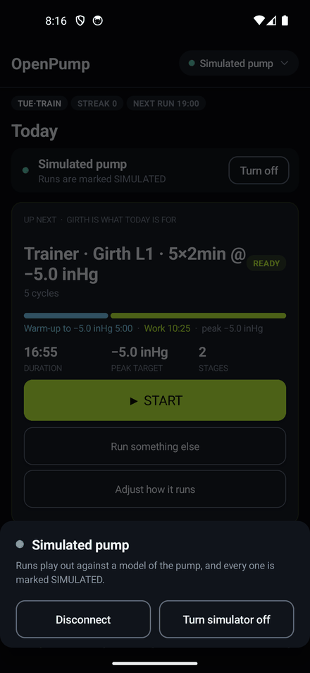

**2. Pick what today is.**
One session, one button. The card says how long it runs, what it peaks at and how many
stages, before you start it.

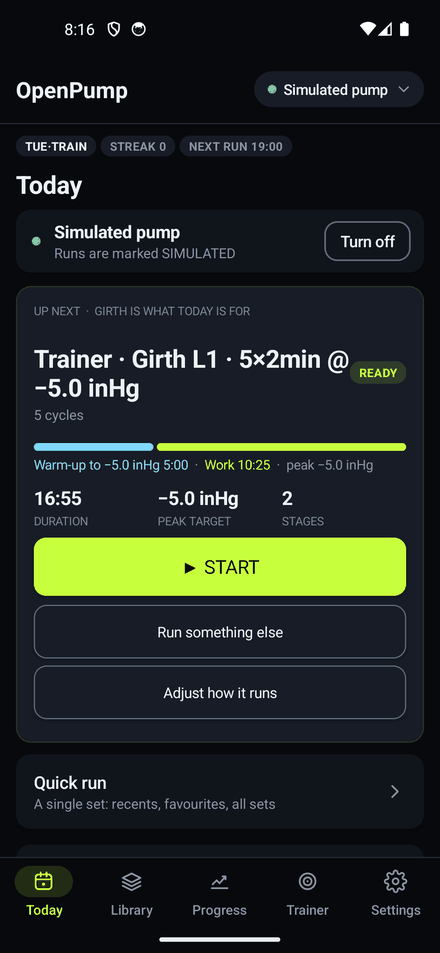

**3. Run it, and steer it.**
The screen draws what the pump reports against what was asked for. Tap − or + on the pull,
the hold or the drop while it's running and the change goes out and shows up. A tap that
would cross a limit tells you which limit stopped it. STOP vents at once, and the app
checks the pump's readings to confirm it did.

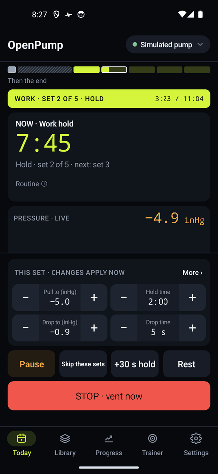

---

## What it looks like

<p align="center">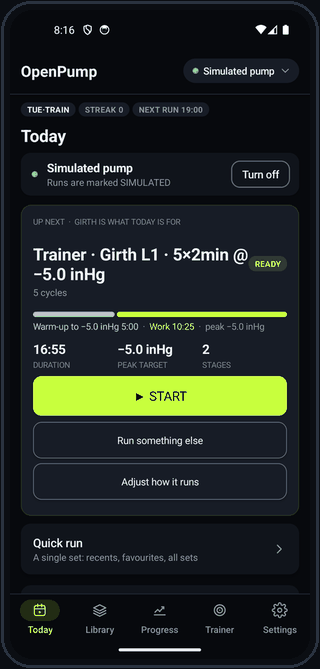</p>

Every shot is of the simulated pump, so there's nothing personal in any of them.

<table>
<tr>
<td align="center" width="25%"><br><b>Today</b><br><sub>One session, one button, and how long it takes.</sub></td>
<td align="center" width="25%"><br><b>The run</b><br><sub>What the pump is doing, live.</sub></td>
<td align="center" width="25%">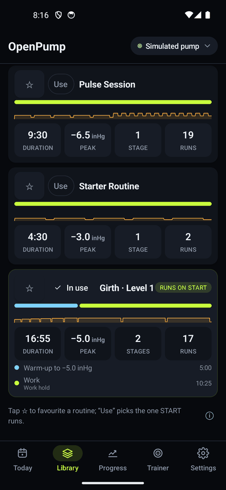<br><b>Library</b><br><sub>Your routines, drawn as the shape they'll run.</sub></td>
<td align="center" width="25%">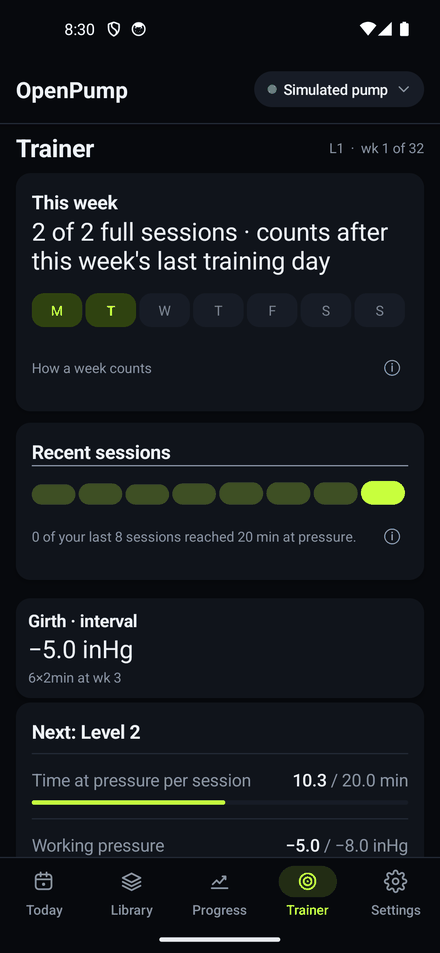<br><b>Trainer</b><br><sub>Your plan: the week, the level, what comes next.</sub></td>
</tr>
</table>

<details>
<summary><b>Four more screens</b>: the editor, a manual run, adjusting mid-run, the summary</summary>
<br>
<table>
<tr>
<td align="center" width="25%">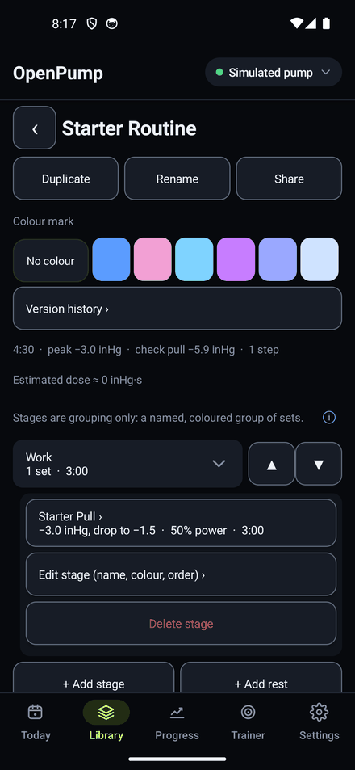<br><b>Routine editor</b><br><sub>Build a routine and share it as a code.</sub></td>
<td align="center" width="25%">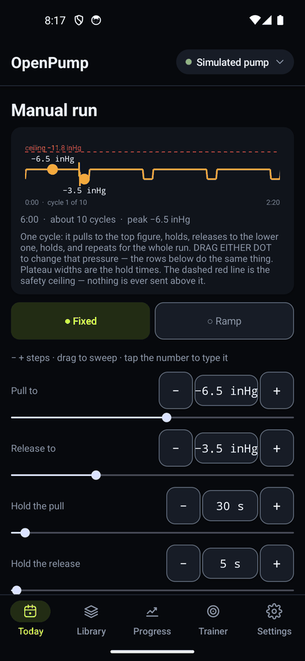<br><b>Manual run</b><br><sub>Drag the dots to set the cycle.</sub></td>
<td align="center" width="25%">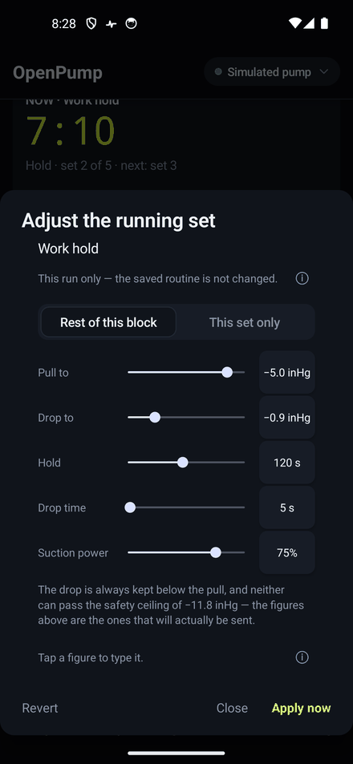<br><b>Mid-run</b><br><sub>Change the pull, times or speed while it runs.</sub></td>
<td align="center" width="25%">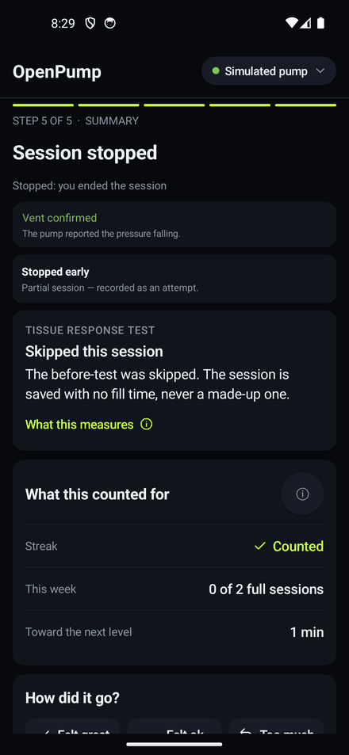<br><b>Summary</b><br><sub>What the session counted for, and why.</sub></td>
</tr>
</table>
</details>

---

## What it does

**Routines — build the session, then keep it.**
Sets grouped into stages — holds, ramps, rests — drawn as the shape they'll run. Star the
ones you use, colour-mark them, and hand one to someone else as a short text code that
brings its sets with it.

**While it runs — change your mind mid-set.**
Tap − or + to move the pull, hold, drop or drop time of the set playing, or how long a rest, a
ramp step or the warm-up runs; the change goes to the pump at once and the countdown carries on.
A longer hold keeps the number of sets and moves the block's end, so every set still runs whole.
More › adds the speed and a choice of this set only or the rest of the block, the routine offset
moves every step still to come, and Coming steps changes or skips the ones after this. Pause it,
skip it, add thirty seconds, drop into a rest. STOP vents at once, and the app checks the pump's
readings to confirm it did.

**What came back — see the pump, not your guess.**
Readings arrive about four times a second and get drawn against the band that was asked
for. A shortfall is named. If the pressure stalls it says nothing is holding instead of
inventing a number, and a reading of zero is treated as *no measurement*, never as
ambient.

**The plan — something that moves over months.**
Two tracks, girth and length, each started where your sessions are now and moved on by
levels with gates, deload weeks and your readings. A week counts with two full sessions of a
track, or three shorter ones. While your readings are on target and your measurements rise,
the next step waits, and the Trainer asks whether to step up now. Every decision shows its
reason. How it all works, number by number, is in
[the trainer guide](docs/trainer-guide.md).

**Progress — measurements, photos, exports.**
Readings standardised under the pump's hold or taken at rest, each compared only with its
own kind, and photos grouped by how they were taken. Photographs lined up, two of them side
by side, streaks, charts, a CSV out. Backups are a zip you put where you like.

**No pump — use it, and work on it, without one.**
The simulated pump is close enough to play whole routines through. It's how the test suite
runs, and it's how anyone can work on this without buying hardware.

**Privacy — go incognito.**
Settings › Privacy has a switch for each feature, plus one "Incognito mode" switch that
turns your chosen set on and off together — all off until you turn them on. Choose a
disguised home-screen icon and name — one of three plain utility apps: "Fitness log",
"Habits" or "Notes" — which the app then wears everywhere it can: in its own top bar, in
recent apps, on its long-press shortcuts, on the app lock and the phone's fingerprint or PIN
prompt, and (Android 13 and up) on the splash as it opens. Add discreet notifications
("Session running · 12:30 left", no pressures or routine names, "Contents hidden" on the
lock screen), hide the app from recent apps (which also blocks screenshots and recording),
and quick hide — double-tap the top bar to leave, with an app lock that asks again when
you come back. Android's own app list and the small name on top of each notification
always say "OpenPump"; no app can change those. Nothing here trades away safety: STOP ("STOP · vent now") always stays
reachable, and the safety alerts still ring and vibrate even when their lock-screen
wording goes neutral.

---

## Getting it running

### If you just want to use it

**Download:** [OpenPump 0.10.0](https://github.com/OpenByte-source/OpenPump-App/releases/download/v0.10.0/OpenPump-0.10.0.apk), under 2 MB, for Android 7.0 or newer. Every version, with its release notes and checksum, is on the [Releases page](https://github.com/OpenByte-source/OpenPump-App/releases). Your phone will ask you to allow installs from your browser.

**Is it really from us?** Every release is signed with the same key. Its certificate's SHA-256 fingerprint is:

```
A2:77:B6:8A:88:AA:CE:C9:D9:13:7E:49:2E:DD:D2:B1:41:D0:37:56:F0:C7:14:3D:44:1E:08:2A:E8:43:40:2D
```

Check a download with `apksigner verify --print-certs OpenPump-0.10.0.apk` (from the Android SDK's build-tools): the SHA-256 digest must match.

**Built it yourself before?** That build was signed with a debug key, so the release can't install over it. Back up first (**Settings › Device & developer › Developer options**, code 0000, **› Backup & restore**), uninstall, install the release, then restore.

Or build it from the source:

```bash
git clone https://github.com/OpenByte-source/OpenPump-App.git
cd OpenPump-App
./gradlew installDebug        # onto a connected phone or an emulator
```

You need JDK 17 or newer and the Android SDK, platform 34. Android Studio installs both.

No pump? In the app: **Settings › Device & developer › Simulated pump.** Every run it files is marked simulated.

<details>
<summary><b>If you want to work on it</b>: the commands, and what's in each folder</summary>

```bash
./gradlew test                  # every check below, plus JUnit. No phone needed
./gradlew :core:selfTest        # ~35,800 assertions
./gradlew :core:wiringCheck     # static pass over the stop/vent paths
./gradlew :core:migrateCheck    # old save files still load
./gradlew :core:scenarioCheck   # 58 whole routines against the simulator
./gradlew :app:assembleDebug    # the APK
```

| Folder | What's in it |
|---|---|
| `core/` | Plain Java 17: the plan, the session engine, the data model, the ZD21 protocol (the Epic Hydro PE Pump's) and its simulator. No Android imports, so its tests run on any computer. |
| `app/` | The Android side: screens, the run service, Bluetooth, notifications, the widget. |
| `docs/` | Architecture, the protocol, decision records, and what's been verified. |

**The diagnostic console** (a raw Bluetooth log with manual pump controls, outside every safety check) is only in debug builds you make yourself, such as `./gradlew installDebug`. It isn't in the release APK. In a debug build: **Settings › Device & developer › Developer options › Debug log / diagnostics.**

Before a pull request: one change, and `./gradlew test` green. [CONTRIBUTING.md](CONTRIBUTING.md) has the rest.

</details>

---

## Helping out

OpenPump gets better when more people use it, question it and take it somewhere new. You don't have to write code to help.

**How we work together:**

- **Talk first, in the open.** Before a big change, open an issue. The design gets argued there, where anyone can see it and join in.
- **Small pull requests.** One change each, small enough to read in one sitting.
- **Tests next to the logic.** New logic goes in `core/` with a test beside it, so anyone can check it without a pump.
- **Two reviewers for anything safety-related.** If a change touches what pressure is sent, when, or how a run stops, two people approve it, and one of them is a safety maintainer. It's how we keep each other honest.
- **Say if an AI helped.** The same checks apply either way.

**Ways in:**
- **Suggest an idea, or vote on one,** in [Discussions › Ideas](https://github.com/OpenByte-source/OpenPump-App/discussions/categories/ideas). The ▲ button is the vote, and the most wanted rise to the top.
- **Report a bug** with the [bug form](https://github.com/OpenByte-source/OpenPump-App/issues/new?template=bug_report.yml): your phone, Android version and pump.
- **Share a capture** from a pump that isn't supported yet, with the [New pump form](https://github.com/OpenByte-source/OpenPump-App/issues/new?template=new_pump.yml).
- **Fix wording** that reads badly, or pick up a `good first issue`.

The details are in [CONTRIBUTING.md](CONTRIBUTING.md). Everyone taking part agrees to the [Code of Conduct](CODE_OF_CONDUCT.md).

---

## How it's put together

<details>
<summary>For developers: the modules, and how a session flows through them</summary>

Everything ships in one APK. The split is so most of it can be read, changed and tested
without a phone.

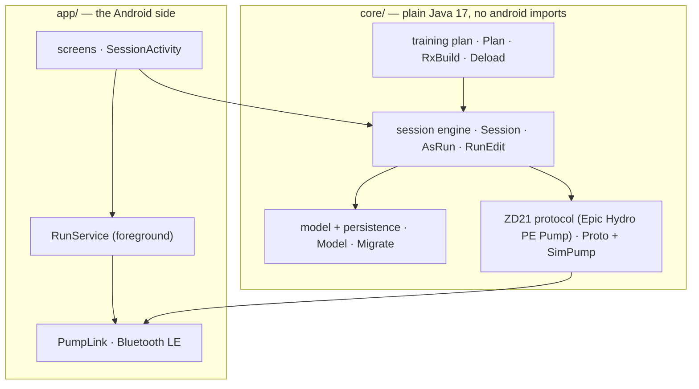

Orders go one way: screens → session logic → pump protocol → Bluetooth. Screens never
build pump frames themselves. What goes over the air, byte by byte, is in
[the pump control guide](docs/pump-control-guide.md). How the trainer plans your training, and
why it asks what it asks, is in [the trainer guide](docs/trainer-guide.md).

- [The trainer program overview](docs/trainer-program-overview.html): the whole program on one page.
- [Measurements](docs/measurements.html): how the app takes a reading and what it does with it.

**Where the next pump goes:** a driver seam between the session engine and the wire, with a
safety supervisor every driver has to pass through and a conformance kit it has to pass.
After that, adding a pump means adding a driver instead of editing a screen.

| | Phase | |
|---|---|---|
| 1 | **A clean repository and a normal build** — Gradle, CI, the core/app split | done |
| 2 | **Finer modules** — model, training, session, progress, safety; `pump/api` and `pump/zd21` | planned |
| 3 | **The driver seam**, the safety supervisor, and a conformance kit every driver passes | next — [the design](docs/design/driver-seam.md) |
| 4 | **Split `SessionActivity`** — the run state machine moves into `core` | planned |
| 5 | **A Kotlin Multiplatform core**, so another phone platform reuses the engine instead of rewriting it | planned |

The reasoning behind each is in [`ARCHITECTURE.md`](ARCHITECTURE.md) and [`docs/adr/`](docs/adr).

</details>

---

## Adding a pump

<details>
<summary>Own a pump that isn't supported? Here's how it gets added</summary>

One protocol is implemented end to end. If yours isn't an Epic Hydro PE Pump, open a *New pump* issue
with the model, the name it advertises over Bluetooth, the pump's packets from a snoop log of
its own app driving it through start, change pressure and stop (an extract with the addresses
replaced, never the raw log), and a note of what it sends back. Protocol
notes are wire facts only — never anyone's app, never decompiled code, never text copied
out of one.

One honest warning: a pump that can't report its own pressure can't confirm a vent, so
support for it would be limited, or declined.

This is what a finished write-up looks like. It's the whole of the ZD21 one (the Epic Hydro PE Pump's) in seven rows:

| | |
|---|---|
| Advertised name | `ZD21_PUMP` |
| Service, write, notify | `fff0` · `fff1` · `fff4` |
| Every command | starts `66 2A <opcode>`; Add, Delete and Start are answered `<opcode> 01`, or `<opcode> FD` when the pump refuses (a Start of an empty slot is `2C FD`), List by the table itself; whether every stop is answered is not yet known |
| Stop | `0x2D` — and it **vents**. A release, not a pause. |
| Presets | nine slots; pressures are whole kPa, 0–57; a hold is one byte, so anything over 255 s is built from several presets; an all-zero preset is not stored |
| What comes back | about four samples a second, as ASCII, in deci-kPa and negative on the wire — and **0.0 means “no measurement”**, not ambient |
| Habits worth knowing | a stop vented at about 4.68 kPa/s the one time it was measured; the pump coasts during a long hold, at a rate not yet measured; once started it keeps cycling on its own, which is why a dropped link is treated as dangerous |

Full version: [`docs/protocols/zd21.md`](docs/protocols/zd21.md), marked verified against a
real device. The steps for a new one: [`docs/adding-a-pump.md`](docs/adding-a-pump.md).

The whole of it — Bluetooth, every command, the preset table, telemetry, how routines, ramps,
long holds and live edits become commands, and how OpenPump stops and confirms a vent — is in
[the pump control guide](docs/pump-control-guide.md).

</details>

---

## Supported pumps

Right now, one: the Epic Hydro PE Pump, over Bluetooth, checked on real hardware. There's also a built-in simulated pump for practice. Support for more pumps comes from the people who own them. [Here's how to add yours](docs/adding-a-pump.md).

---

## What doesn't work yet

- **One pump.** Only the Epic Hydro PE Pump is supported; a pump that can't report its own pressure can't confirm a vent.
- **Android only.** No iPhone version.
- **Not every check has run on real hardware for this version.** What has and hasn't is listed, row by row, in [the release checklist](docs/release-checklist.md).
- **Known issues** are listed in the [changelog](CHANGELOG.md) under each version, among them a pump that coasts during a long hold, which can make a Trainer hold count for less than it ran.
- **The screenshots on this page come from an earlier build.** The 0.10.0 run screen, Trainer and setup look different; the words on this page describe 0.10.0.

---

## Licence

GNU Affero General Public License v3.0 — the full text is in [`LICENSE`](LICENSE). Use it,
read it, change it, pass it on — and whatever you pass on, or offer to other people as a
service, stays open under the same licence. If you send a patch, it's licensed the same
way.

**Who this is and isn't.** An independent project. Not affiliated with, endorsed by or
connected to any pump manufacturer — model names appear only to say what it works with.
The protocol notes here were written from traffic on the wire, nothing else.

The training plan applies publicly available PE guidance mechanically; where the app decides
something the guidance doesn't say, [the trainer guide](docs/trainer-guide.md) marks it as the
app's own choice. It can't know your body, and it isn't advice.

**Contact:** [theopenpe.team@gmail.com](mailto:theopenpe.team@gmail.com) — for anything that shouldn't be a public issue.
Security and safety reports go privately — see [`SECURITY.md`](SECURITY.md).

---

## Disclaimer

> [!CAUTION]
> OpenPump is not a medical device and does not give medical advice. You use it at your own risk.

OpenPump doesn't diagnose, treat, cure or prevent anything, and no health authority has reviewed it. The training plan applies published guidance mechanically. It can't know your body. If you have a medical question, ask a doctor.

The software comes **as is, with no warranty of any kind**, express or implied. As far as the law allows, the authors and contributors **aren't liable** for any injury, harm, loss or damage from using it, or from being unable to use it. This restates sections 15 and 16 of the [AGPL-3.0](LICENSE) in plain words.

Follow your pump's own instructions and limits. Set a ceiling you're comfortable with. Stop if anything hurts, goes numb, changes colour or feels wrong.

Some places don't allow some of these exclusions. Where that's so, they apply as far as your local law allows, and it's on you to check that using OpenPump is legal where you live.

The full text, with the warranty and liability wording, is in [DISCLAIMER.md](DISCLAIMER.md).
