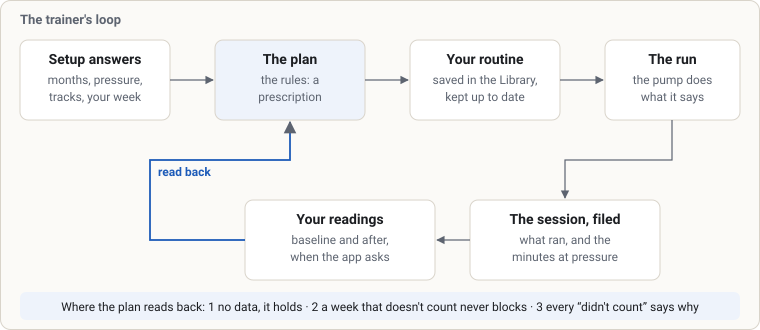
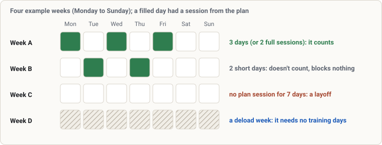
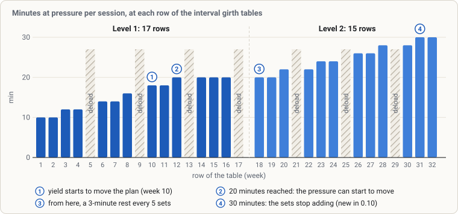
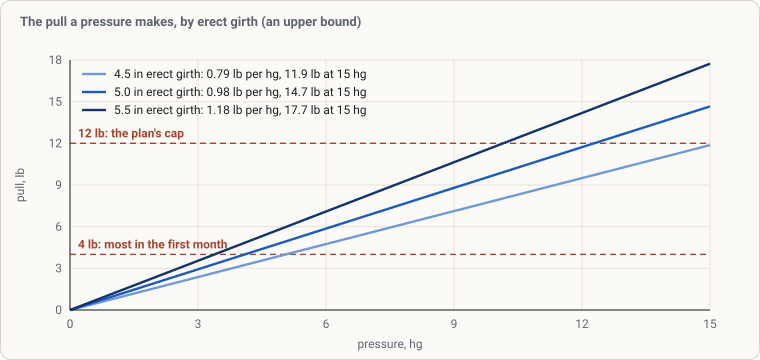
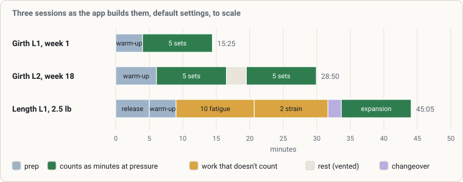
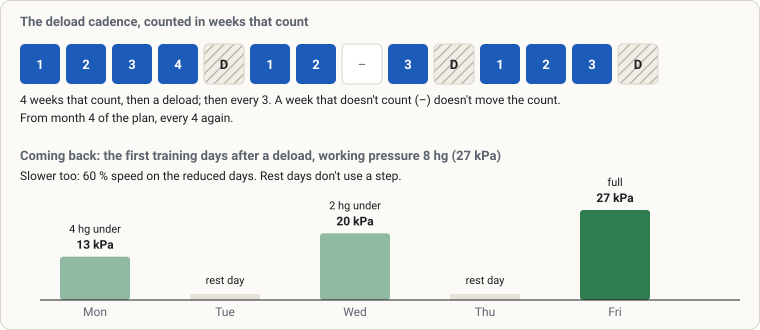

# The OpenPump trainer: how it plans your training

This guide explains how the OpenPump trainer plans your training: what each setup question
changes, why today's session has the sets and pressure it has, what moves you to the next level,
and what happens on a day you run both tracks. It is written for someone who uses the trainer and
wants to know why it asks what it asks. Its companion, the
[pump control guide](pump-control-guide.md), explains how the app drives the pump itself.

The trainer's rules come from the collection of publicly available guidance on PE. Where OpenPump
decided something itself, because the guidance doesn't say or because the app goes further or
differs, the text says *App's choice* and gives the reason. Nothing else is labelled. The guide
describes what the app does. It adds no training advice of its own.

It describes OpenPump 0.10 as built. What 0.10 changed is marked **New in 0.10**, so a reader on
0.9 can skip those parts.

Pressures are given in hg (inches of mercury), the unit the guidance uses. One hg is
3.386 kPa <!-- check Plan.HG ~ 3.386 -->. The app shows them as inHg with a minus sign
(−5.0 inHg), or in kPa if you choose. Every pressure it sends the pump is a whole kPa, so 8 hg
reaches the pump as 27 kPa <!-- check Plan.L1_CAP_KPA ~ 27 -->, which the app shows as −8.0 inHg.

## Contents

- [1. The trainer in one page](#1-the-trainer-in-one-page)
- [2. Setting up](#2-setting-up)
- [3. Your week](#3-your-week)
- [4. The girth track](#4-the-girth-track)
- [5. The length track](#5-the-length-track)
- [6. Feeders](#6-feeders)
- [7. From a plan to a routine](#7-from-a-plan-to-a-routine)
- [8. A day with both tracks](#8-a-day-with-both-tracks)
- [9. Measurements](#9-measurements)
- [10. Deloads, layoffs and coming back](#10-deloads-layoffs-and-coming-back)
- [11. Limits the trainer keeps](#11-limits-the-trainer-keeps)
- [12. Reading the run screen](#12-reading-the-run-screen)
- [13. A worked example](#13-a-worked-example)
- [14. Where the app goes its own way, and what's unconfirmed](#14-where-the-app-goes-its-own-way-and-whats-unconfirmed)
- [Appendix A. Every number in one place](#appendix-a-every-number-in-one-place)
- [Appendix B. Where it lives in OpenPump](#appendix-b-where-it-lives-in-openpump)
- [Appendix C. Words the trainer uses](#appendix-c-words-the-trainer-uses)

---

## 1. The trainer in one page

### What it does

The trainer is a plan that writes your routines. You answer a few questions once. It places you on
a level and a week, writes the routine for your next session, and saves it to your Library when
you say so. After each run it reads back what the session delivered and what you measured, and
decides whether the next routine should change.

It never refuses to start a session. It advises, and the pump's own limits
([chapter 11](#11-limits-the-trainer-keeps)) still apply to every run.

### The tracks

- **Girth**, in one of two styles. **Interval** girth is short holds with a drop between them,
  following a week-by-week table. **Traditional** girth is fewer, longer holds. You run one style
  or the other, never both.
- **Length**, optional, beside either girth style or on its own. With a cylinder that fits for
  traction, a length session pulls, and the pull is governed as a load in pounds.
- **Feeders**, short top-up sessions at a lower pressure, offered from Level 3.

Each track has Levels 1 to 4. Girth's Level 2 is earned: it has a gate you pass. Girth's Levels 3
and 4 come with the months and the minutes your sessions hold, and every length level with the
months.

### The loop

*Figure 1. The loop the trainer runs. The three rules below sit where the plan reads your sessions
back.*

1. The plan works out a **prescription**: how many sets, how long each hold, and at what pressure.
2. You save it as a **routine** and run it. The pump does what the routine says.
3. The run files a **session**: what ran, and how many minutes it held at pressure.
4. When the app asks, you **measure**, and the readings are filed with the session.
5. The plan reads the sessions and readings back and decides what the next routine should be:
   the same, one more set, a little deeper, a rest week, a step back, or the next level.

Once you have saved a plan routine, the plan keeps it up to date. When the prescription changes,
it rewrites the saved routine in place and Today tells you what changed ("6 → 7 sets"), with an
Undo, which puts the whole routine back as it was, its sets and hold lengths included. A routine
left with no holds to run is never started: START says it "has nothing to run" and offers
**Rebuild from the plan**. A routine you have edited yourself is yours: the plan offers the change on its card instead
of overwriting it. That includes a pull or a warm-up you changed. A rest you changed counts too,
unless every rest moved to one length the rest setting offers: that reads as the setting. A
pressure you set in **Adjust first…** is yours too. A new prescription is offered on the card, not
written over it; a lighter day's step still rebuilds it as you set it.

### Three rules everything comes down to

1. **With no data, the plan holds.** It never guesses a change from a signal it doesn't have, and
   it says what it is waiting for.
2. **A week that doesn't count never blocks.** A short week, a session run off the plan, a session
   run while a safety flag is up: none of them stops you. They simply don't move a counter
   forward.
3. **Every "didn't count" says why.** Each hold and each thing that did not count carries its
   reason on the Trainer tab.

*App's choice:* these three are how OpenPump applies the guidance, not rules the guidance states.

---

## 2. Setting up

Setup is six short screens and a confirm screen. Recalibrating later asks only the first three
again. Nothing on them saves a routine: that stays a separate step at the end.

### Screen 1: Months pumping

How many months you have pumped in total, from 0 to 360. If you already have sessions in your log,
the answer is pre-filled from the first one, and you can change it. The trainer uses it to place
you on its calendar instead of starting you at week one.

The same screen asks whether you have had **a break of a week or more recently**. If you say yes,
your starting week moves back two weeks, never before week 1. The guidance says to step back at
least a week after time away, and two to be sure.

### Screen 2: Current working pressure

- **New to pumping** (on by default). While it is on, the beginner's cap applies: at most
  6 hg <!-- check Plan.MONTH1_CAP_KPA/Plan.HG = 6 --> in your first month. Turned off, your own
  answers set the band, and only the limits that hold for everybody remain.
- **Current working pressure**, the pressure you run at now. **New in 0.10:** an answer above or
  below the plan's figure for your level is kept as your own pressure, "plan ± x"
  ([My pressure](#my-pressure-plan--x)); the plan starts at its own figure and your routines run
  that far above or below it. An answer that takes you past the level's usual top
  (10 hg <!-- check Plan.WORKING_CAP_KPA/Plan.HG = 10 --> from Level 2) is asked about once
  when you confirm.
- **Most you will go to**, optional. Once set, nothing the trainer prescribes for girth (and the
  feeder) goes above it, ever - routines, Adjust first and the run screen's controls included.
  Length asks its own on the tracks step. A routine saved
  before you lowered it (or before you turned **New to pumping** on) is held to it too: the plan
  rewrites it, and until then START runs it at the limit and says so in one line.
- **Drop between holds**: the pressure the cylinder falls back to between interval holds,
  3 kPa <!-- check Model().rxDropKpa = 3 --> by default and at most
  10 kPa <!-- check Mint.DROP_MAX_KPA = 10 -->. Time at the drop never counts as time at
  pressure, whatever you set.
- **I mark or bruise easily** (off by default). It turns on the automatic gentle return after a
  break and the larger-cylinder reduction ([chapter 10](#10-deloads-layoffs-and-coming-back)).
  **New in 0.10:** it also gives you the **gentle warm-up**: it starts lower and slower and climbs
  a little each rep to your working pressure ([the shape settings](#the-shape-settings)).

### Screen 3: Tracks

- **Interval** or **Traditional** girth.
- **Hybrid mix (from Level 3)**: from Level 3, five-minute traditional holds take the place of
  the interval work.
- **Length track (optional)**. With length on, you can also turn the girth track off for a
  length-only plan. A plan needs at least one track.
- **Shears during rests (from Level 4)**: at Level 4 the run screen's rest line asks for shears
  during each rest.
- **Add feeder sessions at Level 3** (on by default).
- **Your girth session now** and, with length on, **Your length session now** (**new in
  0.10**): how long your session of that track is now, in minutes, from **Skip** and **I don't
  do this yet** up to 180 in steps of 5. They place each track
  ([below](#how-your-answers-pick-your-starting-point)). With **New to pumping** on they are not
  asked: each track starts at Level 1, week 1.
- With length on: the **Length working pressure** (kept as length's own "plan ± x" in the same
  way), length's own **Most you will go to** (optional, the same as girth's but for length work
  and traction pulls; a setup from before it was asked keeps the one answer for both), and, if
  you are not new to pumping, your **Current length load** (a load past the plan's
  usual 12 lb is asked about once when you confirm, never past 15 lb). With **New to pumping**
  on the load is not asked, and an answer given before you turned it on is ignored: a first setup
  starts at the plan's own load, a recalibration keeps the load you have. **New in 0.10:** both show the conversion between pressure and pounds
  at your logged erect girth ([chapter 5](#5-the-length-track)), or say that they can't until an
  erect girth is logged.

### Screen 4: Your cylinders

The cylinder rack, the same editor as in Settings. It is skippable, but the length track runs as
expansion only until a cylinder that fits for traction is listed.

### Screen 5: How your routines are built

Four presets (standard, a gentle start, a ramped one and a time-saver), then pickers for each
track: warm-up, work sets, pressure, rests and fatigue block. A preview shows the first routine as
the answers would write it. These change the shape of the routine around the work, not what the
plan asks of you ([chapter 7](#7-from-a-plan-to-a-routine)).

### Screen 6: Your week

Your training days (Monday, Wednesday and Friday on a first setup), the reminder hour
(19:00 <!-- check Schedule().hour = 19 --> by default) and whether reminders are on (off by
default). A plan needs at least one training day.

**New in 0.10:** with both tracks on, this screen asks **Long training days**, four choices,
each with its effect under it:

- **Alternate days, each track 3 days a week** (the default on a first setup): girth Monday,
  Wednesday and Friday, length Tuesday, Thursday and Saturday (the other way round when length
  goes first), whatever days are ticked. About an hour a day.
- **Alternate on my days**: the tracks take turns on the days you pick, and the screen asks
  **"Start the week with Length or Girth?"**. Until you answer, the week starts with length. If
  your days give a track fewer than 2 a week, the screen says its plan won't move.
- **Same days, stop growing at 90 min**: both tracks on your days, and the holds and strain sets
  stop growing once a day of both would pass
  90 minutes <!-- check Plan.HELD_AT_90_MIN = 90 -->; the card says so and offers **Switch to
  alternate days** or **Keep as is**.
- **Same days, no limit**: both tracks on your days, as before.

The same row is on the Trainer page, under **When it runs**. With one track on it isn't shown,
and the week is your own days.

*App's choice:* the guidance allows either shape but doesn't say which track should lead an
alternate week, so the app asks.

With both tracks on the same days, the screen says about how long a day of both will be: both
routines as a day of both runs them, with warm-ups and rests, the feeders left out (they come
hours later). If that reaches 90 minutes <!-- check DayLength.NOTICE_MIN = 90 --> it says so in a
heading of its own; the first choice above is the one that shortens it. With alternate days it
says so only if the longest day still reaches 90 minutes.

### The confirm screen

**Your starting point** shows what your answers produced. For girth: **Level and week**, with
what placed it ("Level 1, week 6 — closest to your 20 min", and under it "Placed by your 20-min
session: the plan's closest is 19.6 min."), then **Months pumping**, the lowest pressure, the
pressure the plan starts at and your own pressure against it (**My pressure**, plan ± x), and the
time at pressure per session to aim for, with the deload cadence behind its ⓘ. For length: its
level, a line on how your minutes placed it ("You answered 30 min: length starts at 4 strain
sets, a 28.4-min session — the closest without going over."), and its pressures. If your months
answer and your pressure answer point to different levels, it shows both and takes the lower
([below](#how-your-answers-pick-your-starting-point)). On a first setup it then offers your first
routine, with one button to save it, and a reminder to run it on your training days.

### How your answers pick your starting point

**New in 0.10: by your session's length.** The Tracks screen asks, for each track, how long your
session of it is now, in minutes. The plan starts the girth track at the level and week whose
session, as the plan writes it (warm-up, fatigue block and rests included), is the closest to
your answer without being longer; 0 ("I don't do this yet") or New to pumping starts at Level 1,
week 1, an answer shorter than every session starts at the first, and an answer longer than every
session starts at the highest level your months allow (Level 3 from month 6, Level 4 from month
12, Level 2 before that). A pressure under 8 hg still keeps you at Level 1. Your pressure and
load still come from your pressure answers. The length track keeps its level from the months and
is placed by its strain sets the same way, its calendar going on from the count placed; that
needs a length cylinder that pulls, and without one the months place it. Left at Skip, the months
place you as below, and a setup run again for an upgrade keeps your position unless you answer
it.

**Girth, level.** Each month you answer counts as four weeks. For interval girth:

| Months answered | Level | Starting week |
|---|---|---|
| 0 | Level 1 | 1 |
| 1 to 4 | Level 1 | four weeks per month, so month 1 is week 4 and month 4 is week 16 |
| 5 | Level 2 | the Level 2 table's week 3 |
| 6 to 11 | Level 3 | no table |
| 12 or more | Level 4 | no table |

Traditional girth has no week table, so it stays at Level 1 until
month 6 <!-- check Plan.L2_GATE_MONTH = 6 -->, then Level 3, and Level 4 from
month 12 <!-- check Plan.L3_GATE_MONTH = 12 -->. It starts at its level's first week, whatever
the months, because its holds grow by the weeks you train on the plan at that level (see
[traditional girth](#traditional-girth)). (**Changed in 0.10:** the week used to be read from
the months, four weeks a month, so two months of pumping started Level 1 at four holds.)

A pressure answer below 8 hg <!-- check Plan.L234_FLOOR_KPA/Plan.HG = 8 --> holds you at Level 1
whatever the months say, because every level above 1 works from an 8 hg floor. The answer is read
in whole kPa, as the app stores and sends it, so −8.0 inHg (27 kPa) is at the floor (**fixed in
0.10**: it used to count as under 8 hg's 27.09 kPa). The pressure
answer can hold you back; it never moves you up. When the two answers disagree, the confirm screen
names both and uses the lower level.

**Girth, pressure.** You start at your answer, kept between the level's floor and its cap. The
floor is 5 hg <!-- check Plan.L1_FLOOR_KPA/Plan.HG = 5 --> at Level 1 and 8 hg from Level 2. The cap
is the lowest of: the level's cap (8 hg at Level 1, 10 hg above it), your device ceiling, your
own maximum, 15 hg <!-- check Plan.ABSOLUTE_CAP_KPA/Plan.HG = 15 -->, and, if you are new to
pumping and in your first month, 6 hg. If a maximum you set is below the floor, the floor wins.

So a beginner who answers 4 hg starts at 5 hg, and one who answers 7 hg starts at 6 hg. Someone
not new to pumping who answers 7 hg starts at 7 hg.

**Length.** The length track starts at Level 1 and at your length pressure answer, capped the
same way. For someone new to pumping the cap is 6 hg in the first month and 10 hg after it. For
anyone else only the limits that hold for everybody apply.

**The month.** From then on, the trainer's month is the months you answered plus the whole months
since you answered (a month is 30.44 days, and a month that hasn't finished doesn't count). Every
month-based gate and cap reads this figure.

### When it is working, the steps wait

**New in 0.10.** While a track's readings are on target (girth's latest yield inside 6 to 12 %,
length's strain inside 2 to 6 %) and its at-rest measurement is rising (the average of the last
4 <!-- check GainBrake.WINDOW_WEEKS = 4 --> counted training weeks above the 4 before, standardised
readings where the track has them), the calendar steps come half as often: girth pressure every
6 <!-- check GainBrake.GIRTH_WEEKS = 6 --> training weeks instead of 3, the length climb every
2 <!-- check GainBrake.CLIMB_MONTHS = 2 --> months instead of 1, and the small load step every
4 <!-- check GainBrake.SLOW_WEEKS = 4 --> training weeks instead of 2. When the normal step would
have been due, the Trainer card says so: "You're gaining, so the next step waits until Mon 26
Oct. Step up now?" **Step up now** gives the normal step, proposed as usual; **Wait** keeps the
slower pace. Nothing is ever added because of gains, the return days after a week off and the
gentle week after the month-12 break run at the normal pace, and gains that stall bring the
normal pace back.

### Changing your mind later

- **Recalibrate my position** asks the first three screens again, pre-filled from where you are,
  and places you afresh. The pressure answers start at what each track runs at - the plan's
  figure with your own pressure on it - and left as they are, My pressure stays as it was; a
  changed answer is a new answer, asked about once like any other. Its months are your months in total: what you answered at setup plus
  the whole months since (**new in 0.10**; it used to pre-fill only the months since you first
  set up). It warns you before it would lower your level. During a run it waits
  until the run has finished.
- **Switch to traditional / interval girth** keeps your level and pressure and restarts the week
  at 1, because a week in one style's table means nothing in the other.
- **Pause the plan** stops the plan and keeps your history, measurements and routines. While it
  is paused, the Trainer tab offers two ways back (**new in 0.10**):
  - **Resume where I was** keeps every track's level, week and working pressure. The pressure is
    never higher than when you paused (and never above today's cap for your level and month),
    and the gentle return is armed, so the first two training days back run lighter
    ([chapter 10](#coming-back-the-gentle-return)). If you were away a week or more, that is
    still a layoff, and the plan still offers its step-back ([chapter 3](#a-layoff)).
  - **Set up again** asks the setup questions and places you from your new answers.

---

## 3. Your week

### Training days and the streak

Your training days are the days the plan expects you. The streak follows them, not the calendar:
a day that isn't one of your training days isn't a missed day, and neither is a day inside a
deload.

### What counts as a week

A week runs from Monday to Sunday. It **counts** for a track when you trained that track on at
least 3 <!-- check Plan.TRAINING_WEEK_MIN_DAYS = 3 --> of its days with a session from the plan,
or (**new in 0.10**) when you had
2 <!-- check Plan.TRAINING_WEEK_FULL_SESSIONS = 2 --> full sessions of it: two days whose
sessions together delivered two sessions' worth of what the plan asked of them. So each track
moves on with 2 full sessions a week, or 3 shorter ones, and four days a week (girth twice,
length twice) moves both. Two sessions on one day are one day, and one session never counts on its
own, however long it was.

A girth session's worth is its minutes at pressure against the minutes its routine asked for
that day (on a day of both tracks, the shorter routine it was given; a "Finish here" counts what
it delivered). A length session's is the time it ran against the time its routine plans, never
more than the plan. A reduced day, like the first days back after a deload, is measured against
the track's normal plan, so it is never one of the two full sessions: a week back counts with its
three days, as before. A session filed before the app kept its plan is a full
one if you finished it. Three days count the moment the third is trained, mid-week included, as
before. Two full sessions count only once no more of that track's days are on your schedule that
week: after its last scheduled day of the week has been trained or has passed. So a Monday,
Wednesday and Friday week still counts on the Friday, and a week of two girth days counts after
the second. Weeks from before this rule are counted the same way, so past four-day weeks of full
sessions now count too.

The Trainer's **This week** card shows where the week stands: "Counted", or for one track "1 of
2 full sessions", and for two tracks "Girth 1/2 · Length 2/2", with a line under it such as "This
week: girth 1 of 2 full sessions · 2 of 3 days". Two full sessions still waiting for the track's
last training day read "2 of 2 full sessions · counts after this week's last training day". When
one more session of any length would count the week, Today says "One more session this week and
it counts."

The three days are the low end of the guidance's three to five days a week. *App's choice:*
counting two full sessions as a week is the app's, not the guidance's.

Weeks that count are what move the plan. They advance your place in the girth table, they build
towards a pressure step, and they bring a deload due. A week that doesn't count doesn't block or
undo anything. It just doesn't move the count, and the Trainer tab says why.

**New in 0.10:** for the deload, with both tracks on, a week counts when each track's own week
counts, or when three or more of its days had a girth or a length session and each track was
trained at least once. A day with both is still one day. With one track on, it is that track's
week. For your place in the girth table and for girth's pressure steps, only girth sessions
count.

*App's choice:* the guidance doesn't say how to count weeks when two tracks are trained, so the
app counts the days of both together for the deload.

Feeders never make a day count: they are a top-up, not a training day. Neither does a manual run,
or a routine of your own that isn't marked for a track.

*Figure 3. Four example weeks. Only the first one counts. The second doesn't count and blocks
nothing. The third is a layoff once seven days pass without a session. The fourth is a deload,
which needs no training days.*

### Missed sessions

Once a week has ended, the app looks back at it: how many of the girth days your schedule set
you trained on. This applies to interval girth, whose table has weeks to repeat.

- Missing one or two sessions changes nothing.
- Missing 3 <!-- check Plan.MISS_SESSIONS_FOR_REPEAT = 3 --> or more repeats the week: your next week
  that counts doesn't move you on in the table.
- A week with no girth training at all steps you back a week: your next two weeks that count
  don't move you on.

Missed work is never made up. The plan never doubles a session or asks you to catch up. A week
touched by a deload, a safety flag or a girth-focus block is never charged, and reporting a deload
afterwards gives back any charge for the weeks it covers.

*App's choice:* the guidance says "several" missed sessions repeat the week without giving a
number. The app uses three, the smallest number that fits the word.

### A layoff

7 days <!-- check Plan.LAYOFF_MS/86400000 = 7 --> without any session from the plan (girth or
length) is a **layoff**. A deload you recorded doesn't count as time away. After a layoff the plan
steps back ([chapter 10](#10-deloads-layoffs-and-coming-back)).

---

## 4. The girth track

### Level 1, week by week

Level 1 of interval girth follows a table of 17 weeks: 13 training weeks and 4 deload rows.
Each set is a 2-minute <!-- check Mint.HOLD_INTERVAL_SEC/60 = 2 --> hold at your working pressure,
then 5 seconds <!-- check Mint.DROP_SEC = 5 --> at the drop, so 5 sets are 10 minutes at
pressure. The table adds minutes at pressure and pressure together: the sets rise to 20 minutes
while the pressure moves from 5 to 7 hg, and the step to 8 hg comes once a session holds the 20
minutes.

*Figure 4. The interval girth tables as the app stores them, to scale: minutes at pressure per
session at each row. Hatched rows are the table's deload rows; the app runs the previous row's
sets there (see below).*

<!-- check-table Plan.GIRTH_INTERVAL_L1 -->
| Week | Sets | Minutes at pressure | Pressure in the table, hg | The table's note |
|---|---|---|---|---|
| 1 | 5 | 10 | 5 | start |
| 2 | 5 | 10 | 5 | |
| 3 | 6 | 12 | 5–6 | one more set, about every 14 days |
| 4 | 6 | 12 | 6 | the first month's pressure ceiling |
| 5 | deload | | | |
| 6 | 7 | 14 | 6 | |
| 7 | 7 | 14 | 6–7 | |
| 8 | 8 | 16 | 7 | |
| 9 | deload | | | |
| 10 | 9 | 18 | 7 | yield tracking begins |
| 11 | 9 | 18 | 7 | about 3 % yield is the reference |
| 12 | 10 | 20 | 7 | 20 minutes reached: the pressure starts moving |
| 13 | deload | | | |
| 14 | 10 | 20 | 8 | the pressure steps up after 3 training weeks |
| 15 | 10 | 20 | 8 | |
| 16 | 10 | 20 | 8 | the gate: 20 minutes at 8 hg |
| 17 | deload | | | Level 2 follows |

**Your place in the table.** You start at the week setup gave you. Each week that counts on the
girth track moves you one row on, less any week repeated for missed sessions
([chapter 3](#3-your-week)). Past the last row, the last training row (10 sets) repeats until you
pass the gate.

**Sets first.** The number of sets is the row's. The guidance adds one interval about every 14
days until a session holds 20 minutes at pressure; the table spreads those additions over its
rows.

*App's choice:* the app moves on weeks that count rather than on days on the calendar, so a week
you didn't train doesn't earn a set.

**The deload rows.** On a deload row the app runs the row before it: week 5 runs week 4's 6 sets.
The rest week itself comes from the deload cadence
([chapter 10](#10-deloads-layoffs-and-coming-back)), which counts your training weeks. A rest
week doesn't count, so it doesn't move you on, and each deload row ends up as one more week at
the previous row's sets.

**Pressure while the sets build** (**new in 0.10**). Until your sessions hold 20 minutes, your
working pressure follows the table's pressure column, the lower figure of your row: 5 hg in weeks
1 to 3, 6 hg <!-- check Plan.l1TablePressureKpa(4)/Plan.HG = 6 --> from week 4, and
7 hg <!-- check Plan.l1TablePressureKpa(8)/Plan.HG = 7 --> from week 8, up to
week 12 <!-- check Plan.L1_VOLUME_PHASE_LAST_WEEK = 12 -->, the row where a session reaches 20
minutes. This is the guidance's own schedule. It follows the table only upward: a pressure you
already have above your row's is kept, never lowered. Each step is at most 1 hg, and it comes
only once each of your last 3 <!-- check Plan.YIELD_DEBOUNCE = 3 --> scored sessions at your
current pressure delivered its own planned minutes, so a step never follows straight on another:
three sessions have to run at the new pressure first. The limits every step keeps still hold:
never above 6 hg <!-- check Plan.MONTH1_CAP_KPA/Plan.HG = 6 --> in your first month (month 0) if
you are new to pumping, or the Level 1 cap, your device ceiling or your own maximum, and never in
a deload week, while the
gentle return after one is running, or while a safety flag is up.

**Then the 20 minutes.** Once each of your last three scored sessions has held at least
20 minutes <!-- check Plan.netMilestoneMin(1) = 20 --> at pressure, the pressure rises
1 hg <!-- check Plan.STEP_HG_KPA/Plan.HG = 1 --> after every
3 <!-- check Plan.PRESSURE_RAISE_EVERY_TRAINING_WEEKS = 3 --> weeks that count on the girth
track at your current pressure, until it reaches the Level 1 cap
of 8 hg <!-- check Plan.L1_CAP_KPA/Plan.HG = 8 -->. If you are new to pumping, the cap in your
first month is 6 hg; if not, the Level 1 cap applies from your first day (**fixed in 0.10**: the
6 hg cap used to hold everybody in the plan's first month). The plan keeps its own pressure
exact and the pump takes it in whole kPa, so a start at 5 hg climbs 5.0, 5.9 and 7.1 hg (17, 20
and 24 kPa: the table's 6 hg and 7 hg) with the table, then 8.0 hg (27 kPa) with the step after
the 20 minutes (**fixed in 0.10**: each step used to be stored as the whole kPa, so 6 hg + 1 hg
came out at 6.8 hg and 8 hg took one more step). A table pressure counts as reached once your
working pressure is less than
1 kPa <!-- check Plan.TABLE_REACHED_WITHIN_KPA = 1 --> below it, the closest a whole-kPa
setting gets from below: 23 kPa (6.8 hg) is the table's 7 hg (23.7 kPa), and 20 kPa (5.9 hg) is
its 6 hg.

**The count toward a step** after the 20 minutes (**new in 0.10**) starts when your working
pressure last changed: a step, setup, or your own change on the Trainer. Other changes to your
routine don't restart it: a set added by the table, the reduced days after a deload, a change of
shape, or saving it again. A new level restarts it only if it changes your working pressure
(**new in 0.10**): Level 2 to 3 and 3 to 4 carry the pressure and so keep the count, and
Level 1 to 2 keeps it too when you are already at 8 hg (27 kPa); the next step still asks the
new level's own minutes. Three things hold it back:

- a week counts only with 3 training days, or 2 full sessions, at the current pressure, so the
  week of a step counts only if enough of it came after the step;
- nothing you run in a deload week counts, however light;
- a step never lands in a deload week, while the gentle return after one is still running, or
  while a safety flag is up. It waits for the return to finish on a full-pressure day, and it is
  one step at a time: the step itself restarts the count.

*App's choice:* the guidance raises the pressure every three weeks once you hit 20 minutes. The
app counts weeks that count rather than calendar weeks, and asks that each of the last three
sessions reached 20 minutes, not just one. While the sets build, the pressure is the table's;
the three sessions at the current pressure that each step waits for, and taking the lower figure
where a row gives a range, are the app's.

The Trainer's "The next weeks" card shows the table's pressure for each week. Up to week 12 your
routine follows it as above. The table's 8 hg in weeks 14 to 16 comes with the step after the 20
minutes, so while you wait for those the card can show more than your routine runs.

**The gate.** The plan proposes Level 2 when:

- each of your last three scored sessions held at least 20 minutes at pressure,
- your prescribed pressure has reached 8 hg (27 kPa), and
- your sessions have met both for 2 <!-- check Plan.L1_GATE_HOLD_TRAINING_WEEKS = 2 --> weeks
  that count.

The guidance says the same: reach 20 minutes and 8 hg, keep the routine for two weeks, then move
on. Nothing changes until you tap **Move to Level 2**. A safety flag, a layoff or a deload that is due
comes first.

### Yield

**Yield** is how much thicker you are just after a girth session than just before it:
(after − before) ÷ before × 100. It needs a girth reading at the start of the session (its
baseline) and one at the end, both from the same session ([chapter 9](#9-measurements)).

| Level | Yield target |
|---|---|
| Level 1 | 6 % <!-- check Plan.yieldTargetLo(1) = 6 --> or more (a floor only: nothing happens above it) |
| Level 2 | 6 <!-- check Plan.yieldTargetLo(2) = 6 --> to 12 % <!-- check Plan.yieldTargetHi(2) = 12 --> |
| Levels 3 and 4 | 6 <!-- check Plan.yieldTargetLo(3) = 6 --> to 12 % <!-- check Plan.yieldTargetHi(3) = 12 --> |

**New in 0.10:** the target is the same 6 to 12 % at every level, swelling (edema) included,
since pumping cannot avoid it.

Yield moves the plan from week 10 <!-- check Plan.YIELD_FROM_WEEK_L1 = 10 --> of Level 1, at
every week of Level 2 and above, and from Level 2 on traditional girth. One reading never moves
anything: a change needs 3 <!-- check Plan.YIELD_DEBOUNCE = 3 --> scored sessions in a row on the
same side of the target.

- **Three in a row below the target:** one more set (two from Level 3).
- **Three in a row above the upper target:** nothing at Level 1. At Level 2 any sets yield had
  added come off, back to the table's own count; the table's own additions still come.
  At Levels 3 and 4, two sets fewer, but never below the level's own minimum of
  10 <!-- check Mint.yieldFloorSets(1, 3, 0, 0) = 10 --> sets at Level 3 and
  14 <!-- check Mint.yieldFloorSets(1, 4, 0, 0) = 14 --> at Level 4.
- On traditional girth and the hybrid mix (**new in 0.10**) both answers move one five-minute
  hold at a time.

**When the added sets don't help** (**new in 0.10**). An add is not repeated if it didn't work:
three more readings under the target after a yield add, or no room left for one (the level's top,
below), and the card asks instead: "A week off, or length focus?" (with the length track off,
"Time for a week off?"). **Take a week off**, **4 weeks of length focus** (girth rests for
4 <!-- check PlanCards.LENGTH_FOCUS_WEEKS = 4 --> weeks while length carries on), or **Not now**,
which keeps the volume where it is.

**No girth readings for 4 weeks** (**new in 0.10**). At Levels 3 and 4, from month 6, where
yield is the only thing that moves the volume, 4 <!-- check Plan.NO_READINGS_WEEKS = 4 -->
training weeks without a reading since the last change bring a card: "No girth readings for 4
weeks: add 2 sets? Measuring lets the plan adjust to you." It adds
2 <!-- check Plan.NO_READINGS_GIRTH_SETS = 2 --> sets, or one five-minute hold on traditional
girth and the hybrid mix, never past the level's top.

**A change is kept** (**new in 0.10**). Once it reaches your routine, the extra set (or the sets
taken off) stays on top of the table's or the level's own count; it no longer goes away when the
run of readings ends. After each change the count starts again: the next change needs three new
readings. A yield change never takes a routine below its table row. Moving up a level keeps your
total set count: at Level 2 the difference from the table's week 1 is kept, and into Levels 3 and
4 your whole count, the kept sets included, is the volume that carries. Setting up again and a
change of girth style start from the table's or the level's own count; the month-12 break keeps it.

*App's choice:* the guidance gives the three-sessions rule for Level 3, where it adds two to
three intervals. The app applies it from week 10 of Level 1, where its own table marks yield
tracking as beginning, adds one set below Level 3, and holds rather than cuts at Levels 1 and 2.

Sessions left out of yield: manual runs, sessions without a baseline of their own, and (**new in
0.10**) a girth session whose baseline was taken within 4 hours of the start of a length session,
marked "after other work" ([chapter 9](#9-measurements)).

### What the plan can do

At each look the plan takes the first of these that applies, in this order:

1. **A safety flag**, raised in the check before a session or when numbness after a pull
   hasn't cleared, steps the plan back on every track.
2. **A layoff** steps it back ([chapter 10](#10-deloads-layoffs-and-coming-back)).
3. **Falling short:** when even the best of your last three scored sessions delivered under
   75 % <!-- check TrainerTab.UNDER_DELIVERY_FRAC*100 = 75 --> of what it was asked for, the plan
   steps back. *App's choice:* the guidance says the plan shouldn't run ahead of the tissue; the
   75 % line is the app's.
4. **A deload.** During a deload week the plan changes nothing else. A deload also becomes due
   after enough training weeks, or when you reached the session's whole yield target early: in
   the first 35 % <!-- check Plan.EARLY_TARGET_FRACTION*100 = 35 --> of the sets, in each of your
   last 2 <!-- check Plan.EARLY_TARGET_DEBOUNCE = 2 --> sessions. *App's choice:* the early-target
   rule is the app's.
5. **The next level**, when its gate is met.
6. **More or fewer sets**, from yield or the no-readings card (above), up to the level's top; holds
   past the session's time cap come as pressure ([Levels 3 and 4](#levels-3-and-4)).
7. **More pressure**, by the rules above: at Level 1, the table's pressure while the sets build,
   then a step after every 3 weeks that count. If your device ceiling is below the next step, the
   card says so and asks you to raise the ceiling or hold.
8. **Otherwise it holds**, and says what it is waiting for.

A step back doesn't lower your saved routine. The card says why, and it doesn't offer a new
routine while it stands.

### Level 2

Level 2 starts at week 1 of its own table, numbered 18 to 32, at the 8 hg floor. From week 18 a
rest of 3 minutes <!-- check Mint.REST_SEC/60 = 3 --> falls after every
5 <!-- check Mint.SETS_PER_BLOCK = 5 --> sets. The guidance asks for 3 to 5 minutes; the app uses
the low end unless you choose a longer one (**Rest between blocks**, 3:00 to 5:00, in Trainer ›
What it writes › Hold lengths).

<!-- check-table Plan.GIRTH_INTERVAL_L2 -->
| Week | Sets | Minutes at pressure | Pressure in the table, hg | The table's note |
|---|---|---|---|---|
| 18 | 10 | 20 | 8 | a rest every 5 sets begins |
| 19 | 10 | 20 | 8 | |
| 20 | 11 | 22 | 8 | one more set, about every 14 days |
| 21 | deload | | | |
| 22 | 11 | 22 | 8 | |
| 23 | 12 | 24 | 8 | |
| 24 | 12 | 24 | 8 | |
| 25 | deload | | | |
| 26 | 13 | 26 | 8–9 | the month-6 gate is close |
| 27 | 13 | 26 | 9 | |
| 28 | 14 | 28 | 9 | |
| 29 | deload | | | |
| 30 | 14 | 28 | 9 | |
| 31 | 15 | 30 | 9–10 | 30 minutes: the sets stop adding |
| 32 | 15 | 30 | 10 | the gate: month 6 and 30 minutes |

**New in 0.10:** the table used to stop at week 26, at 13 sets and 26 minutes. It now runs on to
30 minutes <!-- check Plan.L2_EXIT_NET_MIN = 30 --> by the guidance's own Level 2 rule: one more
set about every 14 days, until a session holds 30 minutes at pressure. Rows 27 to 32 are the app's
placement of that rule (*App's choice*): a set every two training rows, as in rows 18 to 26, a
deload row every fourth week where the table already puts them, and the table's pressure moving
towards 10 hg, one step after three training rows. 15 sets run as three blocks of 5 with the
3-minute rest between them. The table's pressure column is shown for reference only; your working
pressure moves by the rule below and never past the cap.

The pressure rises by the same rule as Level 1, once each of your last three scored sessions held
20 minutes <!-- check Plan.netMilestoneMin(2) = 20 --> at pressure (**new in 0.10**; it was 30,
which the table, then ending at 26 minutes, never reached), up to
10 hg <!-- check Plan.WORKING_CAP_KPA/Plan.HG = 10 -->. Every row of the table is 20 minutes or
more, so from 8 hg the pressure can step every 3 weeks that count, as at Level 1. The guidance
builds Level 2 towards 30 minutes and starts raising the pressure once a session holds 20; the
app does the same.

**The gate to Level 3** (**new in 0.10**) is month 6 of the trainer's month **and** the volume:
each of your last three scored sessions held
30 minutes <!-- check Plan.levelExitNetMin(2) = 30 --> at pressure, the table's last rows. It used
to be the calendar alone, so somebody who had missed half of Level 2's build-up was moved on
anyway. The card proposes Level 3, and the sets you had reached, including any yield kept, carry
into it. On traditional girth the volume is each session's own planned minutes.

*App's choice:* the guidance builds Level 2 towards 30 minutes and stops adding there, but
doesn't make 30 a condition for leaving it, and its months 4 to 6 end first. The app asks for the
30 minutes, and its table runs on until the sessions hold them, so following the table always
reaches the gate. The exit volume is read from the table's last row, so the two can't drift
apart. Following the table, Level 3 comes about two months after month 6 (see
[chapter 13](#on-to-level-3)).

### Levels 3 and 4

There is no week table from Level 3. A Level 3 session has 10 sets (20 minutes) and a Level 4
session 14 sets (28 minutes <!-- check Plan.netMilestoneMin(4) = 28 -->), or the count you carried
if that is higher, up to the level's top (**new in 0.10**):
14 <!-- check Plan.GIRTH_INTERVAL_L3_TOP_SETS = 14 --> sets at Level 3 and
18 <!-- check Plan.GIRTH_INTERVAL_L4_TOP_SETS = 18 --> at Level 4. No volume step goes past it, and a
count already above it is not cut.

- **The fatigue block** comes first: 15 <!-- check Mint.fatigueHolds(10, 30) = 15 --> short holds
  of 30 seconds <!-- check Model().rxFatigueHoldSec = 30 --> (the guidance's 30 to 60), a 3-minute
  rest, then the main work in blocks of 5 with 3-minute rests (longer if you chose them). The
  fatigue block never counts as minutes at pressure, though it does count toward the session's
  time cap (below). **Changed in 0.10:** its holds were 10 of 45 seconds; you can pick 30, 45 or
  60 seconds in Trainer › What it writes › Hold lengths, and the block keeps its minutes.
- **The hold** is 2 minutes unless you choose otherwise: from Level 3 you can pick 1 to 3
  minutes, the guidance's range, in Trainer › What it writes › Hold lengths (**Work holds**), and
  the plan changes the set count to keep the same minutes, in whole sets, never past the level's
  top, the time cap or the 90-minute day. Levels 1 and 2 run the 2-minute hold their table
  specifies.
- **The pressure** rises by the same rule, once each of your last three scored sessions held
  20 minutes <!-- check Plan.netMilestoneMin(3) = 20 --> at Level 3 or 28 at Level 4, up to 10 hg.
- **Hybrid mix**, if you turned it on (**new in 0.10**, the guidance's hybrid): after the fatigue
  block, 6 five-minute traditional holds at Level 3 and 8 at Level 4, at the session's pressure
  with a rest between each, in place of the interval blocks. Under the session's time cap
  (below) that is 5 <!-- check Plan.r2MaxHolds(3, 300, 450) = 5 --> at Level 3 and
  7 <!-- check Plan.r2MaxHolds(4, 300, 450) = 7 --> at Level 4 with the standard fatigue block. The
  card and the routine's name say so ("5×5min"). **Adjust first…** can lower that count, never raise it. On the traditional track the work already is five-minute holds, so the mix
  changes nothing there.

**The session's time cap** (**new in 0.10**). A girth session's time at pressure, the fatigue
block included, is capped by level: 20 <!-- check Plan.r2CapMin(1) = 20 --> minutes at Level 1,
30 <!-- check Plan.r2CapMin(2) = 30 --> at Level 2, 36 <!-- check Plan.r2CapMin(3) = 36 --> at
Level 3 and 44 <!-- check Plan.r2CapMin(4) = 44 --> at Level 4, on interval, traditional and the
hybrid mix alike. In 2-minute holds that is 10, 15, 14 and 18 holds (from Level 3 after the
standard fatigue block); in five-minute holds 4, 6, 5 and 7. Holds the plan would write past the
cap don't run. The same dose comes as pressure instead: your pressure times (the cap plus the
minutes not run) over the cap, to the whole kPa, at most one step of 1 hg a morning on the
pressure step's own clock, the rest riding on the next steps, and never past the level's top, your
ceiling, the most you will go to or 15 hg. The card says so: "Your session is at its 36-minute
cap: instead of 2 more holds, the pressure goes up 1.0 inHg (it will rise with the next steps)."
At the time cap and the pressure top it holds. *App's choice:* the caps and the conversion to
pressure are the app's.

**The gate to Level 4** (**new in 0.10**) is month 12 **and** each of your last three scored
sessions holding 20 minutes <!-- check Plan.levelExitNetMin(3) = 20 --> at pressure, the low end
of the guidance's 20 to 21 minutes for Level 3's main work (traditional girth: its own planned
minutes). A Level 3 session carries at least that, so this asks that the sessions really delivered
it.

**Month 12 is a fork**, once both hold, and the card offers both answers the guidance gives:

- **Move to Level 4**, or
- **Take a 4-week break (both tracks)** (**changed in 0.10**): both tracks rest for
  4 weeks <!-- check Plan.LENGTH_BREAK_WEEKS = 4 --> from tomorrow (today's session counts),
  the Trainer says until when, and nothing is offered or reminded meanwhile. The plan starts
  again by itself on the date, or earlier with **Come back now**. The break is not a layoff and
  its weeks are not missed ones; the deload count starts again from the day you come back.
  Girth comes back at Level 3 where it was, never at a higher pressure. The first
  7 days <!-- check MonthBreak.GENTLE_DAYS = 7 --> back are the gentle week: girth at
  60 % <!-- check MonthBreak.GENTLE_PCT = 60 --> of its working pressure, and the gentle
  warm-up on both tracks whether or not you mark easily. Level 4 is offered again after
  4 training weeks <!-- check MonthBreak.L4_AFTER_WEEKS = 4 --> back, and the break is not
  offered again. The same break is on the length card ([below](#levels-and-the-month-12-fork)).
  *App's choice:* the guidance says 4 to 6 weeks off; the app dates it at the near end, and the
  gentle week and the climb back are the app's rules for coming back.

### Traditional girth

Traditional girth is 5-minute <!-- check Mint.HOLD_TRADITIONAL_SEC/60 = 5 --> holds, with a
30-second <!-- check Mint.restSecFor(2, 1) = 30 --> rest between them at every level, and
after the fatigue block too. **New in 0.10**, its holds grow
as the guidance's long-hold path does, by your week at the level:

| Level | Holds |
|---|---|
| 1 | 3 <!-- check Mint.baseSets(2, 1, 1) = 3 --> in its first week, one more every 4 <!-- check Plan.TRAD_WEEKS_PER_HOLD = 4 --> training weeks, up to 6 <!-- check Plan.traditionalSets(1, 13) = 6 --> (30 minutes) from week 13 <!-- check Plan.traditionalTopWeek(1) = 13 -->; the 20-minute time cap runs at most 4 <!-- check Plan.r2MaxHolds(1, 300, 0) = 4 -->, and the holds past it come as pressure |
| 2 | 6 <!-- check Plan.traditionalSets(2, 1) = 6 --> |
| 3 | the fatigue block, then 6 <!-- check Plan.traditionalSets(3, 1) = 6 -->, one more every 4 training weeks, up to 7 <!-- check Plan.traditionalSets(3, 9) = 7 --> (35 minutes) from week 5 <!-- check Plan.traditionalTopWeek(3) = 5 -->; the 36-minute time cap runs at most 5, the rest as pressure |
| 4 | the fatigue block, then 8 <!-- check Plan.traditionalSets(4, 1) = 8 -->; the 44-minute time cap runs at most 7, the rest as pressure |

The weeks are the plan's own count, the same one the interval table moves on: a week counts when
you trained on at least three days of it on this track, or had two full sessions on it (see
[What counts as a week](#what-counts-as-a-week)), and a week the plan repeats after missed
sessions does not move it. So four counted weeks are the guidance's 28 days of training. The
count starts again at each level. On top of this the plan moves it by yield, by the same
three-in-a-row rule, and by the same pressure rule with one difference (**new in 0.10**): instead
of the 20-minute milestone, a step needs each of your last three scored sessions to have held
**its own planned minutes** at pressure, 15 minutes for the starting 3 holds. The weeks at
pressure, the caps, the deload and gentle-return holds and the safety flag are the same. The same person as in
[chapter 13](#13-a-worked-example), on traditional girth, steps up in weeks
4 <!-- check TraditionalRaiseTest.TRAD_STEP_1 = 4 --> (to the first month's 6 hg cap),
8 <!-- check TraditionalRaiseTest.TRAD_STEP_2 = 8 --> and
12 <!-- check TraditionalRaiseTest.TRAD_STEP_3 = 12 -->, reaching 8 hg.

**The gate to Level 2** (**new in 0.10**) mirrors the interval gate with the same difference:
each of your last three scored sessions held its own planned minutes, the pressure reached
8 hg <!-- check Plan.L1_GATE_PRESSURE_HG = 8 -->, and both held for
2 <!-- check Plan.L1_GATE_HOLD_TRAINING_WEEKS = 2 --> weeks that count. It used to ask for
20 minutes a session, which the 2 sets of 5 minutes it then ran never reached, so a traditional
track could not leave Level 1. The same person reaches it in week
15 <!-- check TraditionalRaiseTest.TRAD_GATE_WEEK = 15 --> (month
3 <!-- check TraditionalRaiseTest.TRAD_GATE_MONTH = 3 -->).

*App's choice:* "its own planned minutes" as the time a traditional step and the traditional
gate wait for is the app's.

*App's choice:* the guidance's 28 days are counted as four training weeks, the count the
interval table uses, so a week you did not train does not add a hold. The guidance adds a hold
at Level 2 as well, though that level already starts at its 30 minutes; the app keeps Level 2 at
6. A traditional routine saved before 0.10 ran 2 holds at every level. At Level 1 it is rewritten
once to the level's first week, with the plan-change note and Undo, and grows from there rather
than jumping to where its weeks would have put it.

**A traditional routine saved before 0.10, above Level 1** (**new in 0.10**) builds up to its
level's count instead of jumping from 2 holds to 6 or 8. It starts at half the level's count:
3 <!-- check Plan.traditionalHalfStart(2) = 3 --> holds at Level 2 and
4 <!-- check Plan.traditionalHalfStart(3) = 4 --> at Levels 3 and 4, or at what it was running
if that is more. It then adds one hold every 2 <!-- check Plan.TRAD_BUILD_WEEKS_PER_HOLD = 2 -->
training weeks, counted as above, until it reaches the level's count at that point; from then on
it follows the level as everybody does. At Level 3 that is 4, 4, 5, 5, 6, 6, 7, 7 and 8 holds
over its first nine counted weeks, never above Level 3's own count for the week, and the
session's time cap stops what runs at 5 (the rest comes as pressure). Holds a yield reading adds go on top of the
build-up, and a yield cut never takes it under its own count. Moving up a level during the
build-up carries on building from the holds you run, on the same two-week rhythm; a level whose
count is no more than that is joined as usual. The level gates do not read the number of holds,
so the build-up does not change when you move up. The plan-change note says the build-up once.

*App's choice:* the yield sets an old routine had kept count as part of "what it was running":
they are folded into the build-up's start, so 2 + 2 kept starts at 4, not at 4 + 2.

---

## 5. The length track

### How a pressure becomes pounds

Inside a cylinder that fits closely, the vacuum pulls on the penis like a piston. The pull is the
pressure times the cross-section at the base, and the cross-section comes from your erect girth:

    load (lb) = pressure (psi) × girth² ÷ 4π      (girth in inches)

One hg is 0.491 psi <!-- check Traction.PSI_PER_INHG ~ 0.491 -->. At 5 inches of erect girth,
each hg pulls about 0.98 lb <!-- check Traction.lbPerInHg(5) ~ 0.98 -->. The figure is an upper
bound: friction at the seal and the give of the tissue take some of it away, and nothing in the
app measures the tension that is left. That is why the app writes a load as "up to 2.6 lb".

*App's choice:* the guidance gives the loads but not this conversion. The app works it out from
the physics.

*Figure 5. The upper-bound pull for three erect girths, to scale. A thicker girth pulls harder at
the same pressure, so the same load needs less pressure. The dashed lines are the first month's
cap and the plan's cap.*

The conversion needs your **erect girth**: the app uses your latest erect-girth reading and
ignores soft ones, because a soft girth is smaller and would make the app ask for more pressure
than it says. **New in 0.10:** the length setup screen shows the conversion both ways, or says it
can't until an erect girth is logged.

### Whether your cylinder pulls

The app sorts each cylinder in your rack by its bore's circumference against your erect girth:

| Bore circumference ÷ erect girth | What it is for |
|---|---|
| under 0.92 <!-- check Traction.FIT_TRACTION_MIN = 0.92 --> | too tight |
| 0.92 to 1.10 <!-- check Traction.FIT_GIRTH_IDEAL_MIN = 1.10 --> | length: it pulls |
| 1.10 to 1.16 <!-- check Traction.FIT_GIRTH_OVERSIZE_MIN = 1.16 --> | girth |
| 1.16 to 1.32 <!-- check Traction.FIT_TOO_LOOSE_MIN = 1.32 --> | girth, oversize |
| 1.32 and over | too loose |

The guidance sizes a girth cylinder 10 to 15 % over your girth. *App's choice:* the band for a
traction cylinder is the app's. The sorting is redone at each look, so a girth cylinder you grow
into can become a traction one without anyone relabelling it.

With no erect girth logged, or no cylinder in the rack that pulls, the length session runs as
**expansion only**: no traction, just its expansion sets. The card says which it is. Its levels
still come with the calendar ([below](#levels-and-the-month-12-fork)), and the expansion then runs
up to that level's top, moved by your length offset.

### The load ladder

| | Load |
|---|---|
| Start | 2.5 lb <!-- check Plan.LENGTH_LOAD_START_LB = 2.5 --> |
| One step | 0.5 lb <!-- check Plan.LENGTH_LOAD_STEP_LB = 0.5 --> |
| Most in your first month | 4 lb <!-- check Plan.LENGTH_LOAD_M1_MAX_LB = 4 --> |
| What Level 1 aims for | 5 lb <!-- check Plan.LENGTH_LOAD_L1_TARGET_LB = 5 --> |
| The plan's cap | 12 lb <!-- check Plan.LENGTH_LOAD_MAX_LB = 12 --> |

The start, the first month's limit, the Level 1 aim and the cap are the guidance's. *App's
choice:* the half-pound step is the app's; the guidance says to add weight without giving a size.

Your device can also be the limit: at a thin girth, even your device ceiling may not reach the
load. The load card says which of the two limits you are against, because raising the ceiling
only helps against one of them.

If you are not new to pumping, setup asks your current load (1 to 15 lb) and starts you there;
past 12 lb it asks once before it keeps it. The plan's own steps never take you past 12 lb; your
length offset ([My pressure](#my-pressure-plan--x)) moves every pull by its own pounds, and never
past 15 lb.

### Before month 3: the calendar

Until month 3 <!-- check Plan.LENGTH_METRICS_FROM_MONTH = 3 --> of the trainer's month, the length
ladder runs on the calendar, counting the weeks that count on the length track (three length
days, or two full length sessions; see [What counts as a week](#what-counts-as-a-week)):

- every 3 <!-- check Plan.LENGTH_STRAIN_ADD_WEEKS = 3 --> such weeks earn one more strain set,
  starting from 2 <!-- check Plan.LENGTH_STRAIN_SETS_START = 2 -->;
- every 2 <!-- check Plan.LENGTH_LOAD_STEP_WEEKS = 2 --> such weeks earn 0.5 lb, up to 5 lb and
  never past the month's cap.

The guidance gives both: a strain set every three weeks, and more weight every two weeks until
5 lb. *App's choice:* the app counts weeks you trained rather than calendar weeks.

The card offers one step at a time, sets before load, and names where the calendar has got to
("2 to 3, on the way to 4"). Nothing changes until you tap it. When the calendar has nothing new,
the expansion's pressure can still rise (item 8 below).

### From month 3: your readings steer it

**New in 0.10:** from month 3 <!-- check Plan.LENGTH_METRICS_FROM_MONTH = 3 --> the length session
runs 6 <!-- check Plan.LENGTH_HANDOVER_SETS = 6 --> strain sets, the guidance's table for months 4
to 12. Set up at month 3 or later and you start there; reach month 3 on the calendar and one card
takes you there in one step.

Then the ladder reads one figure: the **after-session reading** of a length session that pulled,
against that session's own before-reading, in your bone-pressed stretched length
([chapter 9](#9-measurements)). A reading around a girth session, an expansion-only session, a
stopped one or one in a deload week is left out, though it still shows you measure. The target is
above 2 % <!-- check Plan.LENGTH_STRAIN_LO = 2 -->: 2 to 4 % is good, 4 to
6 % <!-- check Plan.LENGTH_STRAIN_HI = 6 --> is fine. It takes the first of these that applies:

1. **A girth-focus block is running**: the ladder holds until it ends (below).
2. **Over 6 %**: **Measure again**. A second reading over 6 % since the work last changed confirms
   it, and the card offers to lower the load by 0.5 lb, at most once in
   7 days <!-- check Plan.LENGTH_CUT_GAP_DAYS = 7 --> and never under
   5 lb <!-- check Plan.LENGTH_LOAD_FLOOR_LB = 5 -->. At 5 lb, or under it, nothing is cut: measure
   again, and rest if it stays high. After two cuts in a row the card asks you to check that the
   cylinder isn't slipping, and how you measure. **Measure again** on the day of the session, and
   your new after-reading replaces that day's reading.
   After a cut the monthly rise and the slow load step wait for a reading at 6 % or under.
3. **Under 2 % for a week**: a low reading still showing
   7 days <!-- check Plan.LENGTH_MISS_DEBOUNCE_DAYS = 7 --> after the first low one. The plan asks
   what this block (your training since the last deload) did:
   - **It fell**: the block had a reading at 2 % or more. The week off starts tomorrow, or is next
     anyway, and no set is added.
   - **It never reached 2 %**: one more strain set, up to
     12 <!-- check Plan.LENGTH_STRAIN_SETS_MAX = 12 -->; with 12, 0.5 lb more up to the cap.
   - **Still under a week after that set**: a card offers a week off or a girth block, once a
     block. **Not now** carries on, and the next week under adds a set.

   A reading on a lighter day after a deload counts for "the block reached 2 %", but it does not
   start, lengthen or end the week of low readings. With 12 sets and the load at its cap there is
   nothing to add, and the plan goes on to the items below: the next level, and the expansion's
   pressure.
4. **No readings for 4 training weeks** <!-- check Plan.NO_READINGS_WEEKS = 4 -->: one more strain
   set, then 4 more weeks, only up to
   6 <!-- check Plan.NO_READINGS_LENGTH_TOP = 6 -->. Past 6 the sets need your readings.
5. **Length load after month 3**, your setting. With **Small steps over time** (the default) the
   load rises 0.5 lb every 2 <!-- check Plan.LENGTH_LOAD_STEP_WEEKS = 2 --> length training weeks
   while you are under 12 strain sets: towards 5 lb before month
   6 <!-- check Plan.LENGTH_SLOW_LOAD_FULL_MONTH = 6 -->, then towards 12 lb. Never past the most
   you will go to, never on a lighter day after a deload, never while a reading is over 6 %, and
   every 4 weeks while you are gaining on target ([chapter 2](#when-it-is-working-the-steps-wait)).
   With **Only after 12 strain sets** the load moves only from 12 sets, as before.
6. **Stretched length rising while erect length stays flat** for
   6 weeks <!-- check Plan.DIVERGENCE_WEEKS = 6 -->: a girth-focus block (below).
7. **The next level**, by the calendar.
8. **The expansion's pressure** rises 1 hg a month: a full month (30.44 days) after your length
   pressure last changed, whatever else changed in the routine. The last step lands on the top. It
   is held at 6 hg in your first month and goes up to 10 hg. If your most for length is above
   that, it carries on a step a month to it, and the pull follows one step at a time: 0.5 lb, or
   what one step of pressure adds in your length cylinder if that is more, never past 15 lb. Past
   12 lb before month 12, the card says so once. Not on a lighter day after a deload, and not
   while your last reading is over 6 %. A load cut also lowers that pressure, never under the top.
9. **Otherwise it holds**, with the reason.

The table's 6 sets, the week of low readings and the cap of 12 strain sets are the guidance's.
*App's choice:* the 2 to 6 % window on one after-session reading, the 5 lb floor and reading each
block are the app's, and so is the monthly rise of the expansion's pressure; the guidance gives
only the first month's 6 hg. **Changed in 0.10:** the three-week fatigue figure no longer brings a
deload; a reading that fell does.

A safety flag, a layoff and a deload come first, on the length track as on girth.

### Levels, and the month-12 fork

Length levels come with the calendar:
Level 2 from month three <!-- check Plan.lengthGateMetNextLevel(1, 3) = 2 -->,
Level 3 from month six <!-- check Plan.lengthGateMetNextLevel(2, 6) = 3 --> and
Level 4 from month twelve <!-- check Plan.lengthGateMetNextLevel(3, 12) = 4 -->, with a cylinder
that pulls or without one (**fixed in 0.10**: without one the track stayed at Level 1). Moving up
changes the level and nothing else: your load and strain sets are the ladder's to move. Unlike girth's
Levels 3 and 4 (**new in 0.10**), the length gates stay the calendar alone: the guidance names no
volume for leaving a length level, and its length progressions follow strain and fatigue, which
the ladder already reads.

At month 12 the card offers the guidance's three answers:

- **Move to Level 4**,
- **Take an 8-week girth block**, or
- **Take a 4-week break (both tracks)** (**changed in 0.10**): the same break as on the girth
  card, both tracks resting. Length comes back at its level and strain sets, at
  75 % <!-- check MonthBreak.BACK_SHARE*100 = 75 --> of its load (never under the
  5 lb <!-- check Plan.LENGTH_LOAD_FLOOR_LB = 5 --> floor), and takes no load step in the gentle
  week; its Level 4 is offered again once the gentle week has ended. Then it climbs back: each week under 2 % raises the load by half the way back to what it
  was, the last step landing on it - in place of the usual answers to a low week. Readings
  inside the window take the usual pace, and a confirmed high cut ends the climb back.

*App's choice:* the guidance's break is 4 to 6 weeks; the app dates it at the near end.

### The girth-focus block

A girth-focus block lasts 8 weeks <!-- check Plan.GIRTH_FOCUS_WEEKS = 8 -->. The length session
drops its pulls and doubles its expansion to 10 sets, as the guidance's girth focus does, then
hands the track back on its own when the date passes. The card that ends it scores the block by
how much your girth sessions expanded, against 6 <!-- check Plan.GIRTH_FOCUS_YIELD_LO = 6 --> to
8 % <!-- check Plan.GIRTH_FOCUS_YIELD_HI = 8 -->.

**New in 0.10:** while the block runs, the girth track pauses. Today doesn't offer girth sessions,
and the block's weeks don't count as missed.

*App's choice:* the guidance gives a girth focus of one to three months; the app's 8 weeks is the
middle, and what starts one (six weeks of stretched length outrunning erect) is the app's. Pausing
the girth track is the app's too, since the doubled expansion is already the girth work of those
weeks.

### The deload week

**New in 0.10:** a deload week rests the length track completely: no length session and no
traction, as the guidance describes a deload. After the week the pulls come back at your normal
load. See [chapter 10](#10-deloads-layoffs-and-coming-back).

---

## 6. Feeders

A **feeder** is a short top-up session between your main sessions.

- **From Level 3** of the girth track, if **Add feeder sessions at Level 3** is on.
- **5 × 2 minutes** <!-- check Mint.FEEDER_SETS = 5 -->, 10 minutes of holds.
- **At 75 %** <!-- check Plan.feederPressureKpa(100) = 75 --> of the day's main girth pressure. The
  guidance says 70 <!-- check Plan.feederPressureLoKpa(100) ~ 70 --> to
  80 % <!-- check Plan.feederPressureHiKpa(100) ~ 80 -->; *App's choice:* the app takes the middle.
- **2 a day** <!-- check Plan.FEEDER_PER_DAY = 2 -->.
- **Paused** during a deload week, while a deload is due, and while a safety flag is up.
- **Offered after the day's main work**, never instead of it.

Feeders run on **girth days only**: once that day's girth session is done. A feeder waits
4 hours <!-- check Plan.FEEDER_MIN_GAP_MS/3600000 = 4 --> after the end of that girth session, as
well as 4 hours after the start of the last feeder. The guidance puts feeders 4 to 6 hours from the
main session; the six is the far edge, not a deadline. Today and the feeder card show "from HH:MM",
and one tap starts it sooner. A day of length only, and a rest day, have no feeder.

A feeder never counts as a training day: not for a week that counts, the deload, a layoff or the
gentle return. On a day the gentle return lowers the pressure, the feeder takes 75 % of that day's
lower pressure.

---

## 7. From a plan to a routine

### What a routine contains

A prescription is a set count, a hold and a pressure. The routine the plan writes from it has
stages around the work, and each stage has a role. The
[pump control guide's chapter 6](pump-control-guide.md#6-from-a-routine-to-pump-commands) explains
how a routine becomes commands to the pump.

**A girth session:**

| Stage | Role | What it is |
|---|---|---|
| Warm-up | prep | about 5 minutes of reps <!-- check Plan.P2_WARM_SEC/60 = 5 -->: from 12 kPa <!-- check Plan.P2_START_KPA = 12 -->, at most 3 kPa <!-- check Plan.P2_STEP_KPA = 3 --> higher each rep, up to your working pressure; holds grow from 30 <!-- check Plan.P2_HOLD0 = 30 --> to 60 seconds <!-- check Plan.P2_HOLD1 = 60 -->. Where it stops short, the holds after it climb on 1 kPa <!-- check Plan.P2_CARRY_KPA = 1 --> a hold. None within 30 minutes of the other track |
| Fatigue block | work that doesn't count | from Level 3: 15 holds of 30 seconds, then a rest |
| Work | work that counts | your sets: each a hold at the working pressure, then 5 seconds at the drop |
| Rests | rest | vented, between blocks of 5 sets from Level 2, and between traditional sets |
| Retention | retention | off by default: one hold of 5 minutes <!-- check Model().rxRetentionMin = 5 --> at about 4 hg, never above the work |
| Tissue response test | measurement | off by default ([chapter 9](#9-measurements)) |

*App's choice:* the pump warm-up is the app's own. The guidance's preparation (massage, bends,
stretches) is done by hand before the pump, and the app doesn't prescribe it.

**A length session that pulls:**

| Stage | Role | What it is |
|---|---|---|
| Tunica release, by hand | prep | vented: 5 minutes <!-- check RxBuild.TUNICA_RELEASE_SEC/60 = 5 --> shown as a guide; at 0:00 it says "Done when you are" and waits for **Done** before the warm-up starts |
| Warm-up | prep | as for girth, in the traction cylinder, ending at 80 % of the pull; the fatigue holds climb on from there |
| Fatigue holds | work that doesn't count | 10 <!-- check RxBuild.TRACTION_FATIGUE_HOLDS = 10 --> holds of 60 seconds <!-- check Mint.TRACTION_FATIGUE_HOLD_SEC = 60 --> at the governed load, released to zero for 10 seconds <!-- check Mint.TRACTION_FATIGUE_REST_SEC = 10 --> between them |
| Strain holds | work that doesn't count | one hold of 5 minutes <!-- check Mint.TRACTION_STRAIN_HOLD_SEC/60 = 5 --> per strain set, 30 seconds <!-- check Mint.TRACTION_STRAIN_REST_SEC = 30 --> released between them |
| Changeover | logistics | vented: swap to your girth cylinder. It waits for "I've swapped" and shows 2 minutes <!-- check RxBuild.CHANGEOVER_SEC/60 = 2 -->. Not on a day of both tracks |
| Expansion | work that counts | 5 <!-- check RxBuild.CODA_SETS = 5 --> intervals of 2 minutes <!-- check RxBuild.CODA_HOLD_SEC/60 = 2 --> at your length pressure, in the girth cylinder. Not on a day of both tracks |

That is the guidance's first length session for a length device and a pump: preparation by
hand, ten one-minute holds, two five-minute strain holds, then five two-minute intervals. A
traction hold has no drop: it pulls and holds. Without a cylinder that pulls, the length session
is a warm-up and the 5 expansion intervals, and its warm-up goes up to the expansion's
pressure. The length warm-up in front of the pulls ends at 80 % of the pull, so it never repeats
the coming work from cold.

*Figure 7. Three sessions as the app builds them, to scale, with default settings. Only the dark
green stages count as minutes at pressure: 10 minutes, 20 minutes and 10 minutes.*

### What counts as a minute at pressure

A second counts as **time at pressure** while the reading is at or above the level's floor:
5 hg at Level 1 and 8 hg from Level 2, less a counting tolerance of
2 % <!-- check Model().tupCountPct = 2 --> you can change in Settings. So these never count:

- the drop between holds, which is always below every floor;
- rests, where the cylinder is vented;
- the warm-up, the fatigue block, the retention hold, traction holds and the hand release;
- anything before the routine starts (the guided start, a tissue test) or after it ends.

On a day the pressure is reduced ([chapter 10](#10-deloads-layoffs-and-coming-back)), the floor
moves down by the same amount, so work at the lower pressure still counts. Only sessions from a
plan routine are scored this way; feeders and your own routines aren't.

*App's choice:* the guidance gives pressures but no line below which time stops counting. The
floors are the app's.

### Saving it

The track's card shows the prescription with **Save routine**, **Adjust first…** and **Not now**.
Adjust lets you change the set count or the pressure before saving; the pressure is still held
to your level's top (moved by My pressure) and never past your ceiling, the most you will go to
or 15 hg, and the Program's gentle or firm choice doesn't move a pressure you set (a lighter
day still takes its cut). Adjust starts from what the plan's routine runs: the pressure with
gentle or firm already applied, and with the hybrid mix, its five-minute holds. A lower count
there means fewer holds, never more than the guidance's. The saved routine is named after what it runs, for example
"Trainer · Girth L1 · 5×2min @ −5.0 inHg" (make-up cycles included), and marked as the plan's -
an adjusted one too, so the plan keeps it up to date as you set it.

From then on the plan keeps it up to date ([chapter 1](#the-loop)). You can also have a
prescription **split into two parts** for two sessions a day: the first part takes the larger
half, the warm-up goes in both by default, and the retention hold goes in the last. A length
session that pulls is never split.

### My pressure (plan ± x)

**New in 0.10.** Each track - girth and length - has one card, **My pressure**, in place of the
old working-pressure stepper. It shows the plan's own pressure and yours: the plan's figure plus
or minus your offset, in steps of 0.1 inHg (a whole kPa in kPa).

- Every routine the plan writes for that track runs at the plan's figure plus your offset. The
  plan keeps stepping up underneath exactly as it did; every step still happens, on top of your
  offset.
- The level's top moves with your offset, so the steps land where they always would, shifted.
  An offset that takes you past the usual top is asked about once; a higher one asks again.
- Nothing ever goes past your ceiling, the most you will go to or 15 hg. If you said you are new
  to pumping, your first month stays at the plan's own figure (at most 6 hg, 4 lb of traction);
  your offset starts in your second month.
- Below the plan, your time still counts: the line net time counts from moves down with you.
  The level gates read the plan's own figure, so an offset neither earns nor withholds a level.
- On the length track one offset moves both halves of a traction session: the pulls take it in
  pounds at your girth, the expansion in pressure. A pull can go past the usual 12 lb only
  through your offset or your setup answer, never past 15 lb.
- Changing it rewrites the track's saved routines at once, with the plan-change notice and Undo.

### The shape settings

The pickers from setup's fifth screen stay in the Trainer, under what the plan writes. They
change the shape around the work, never what the plan asks of you:

- **Warm-up:** none (it leaves the guidance's plan), short (2 minutes), standard, or a climb.
  **Changed in 0.10:** every choice but none now builds the same warm-up, the 5-minute climb of
  reps described [above](#what-a-routine-contains) (the gentle warm-up instead if you mark or
  bruise easily); the others stay saved for routines of your own.
- **Work sets:** fixed holds, a ramp in each set, ascending, or a pyramid.
- **Ramps** (**new in 0.10**), shown while a track's work sets are a ramp in each set, one set of
  settings for both tracks. A block of holds climbs to your working pressure, then holds there:
  - **Start at**: the first block starts at 80 % <!-- check Model().rampStartPct = 80 --> of the
    day's working pressure (after your own offset, gentle or firm and any lighter day), 60 to
    95 %. It used to start at your level's floor.
  - **After a rest, climb**: a block after a rest climbs only 2 <!-- check Model().rampShortSteps = 2 -->
    steps, the last at your working pressure - or none, starting straight at it; up to 3.
  - **Each hold climbs**: at most 1.0 inHg <!-- check Model().rampStepHg = 1.0 --> a hold, down to
    0.3 inHg. The pump takes whole kPa, so 1.0 inHg is 3 kPa a hold, never more.
  - **Lighter days keep the ramp** (on): a taper or cylinder day climbs to its lighter pressure.
    Off, a lighter day runs fixed holds.
  - **Count the climbing holds** (on): the climbing holds are part of the block's holds, and a
    counted climbing hold's shortfall under your working pressure is made up with extra holds at
    it. A climbing hold under the line your time is counted from counts nothing: it isn't made up
    and isn't in the target, so a Ramped session is about as long as fixed holds. Your level
    credits it at the rate you delivered the target, so a full session reads as the plan's
    minutes and the level still moves. Off, only holds at your working pressure count: the block
    keeps all its holds there, the climb comes first, and nothing is made up for it.
  A preview shows today's climb, for example "First block: −8.0 → −8.9 → −9.4 → −10.0 inHg, then
  −10.0 inHg · after a rest: −9.4 → −10.0 inHg". Any change rewrites the trainer's routines at
  once, with the plan-change note and Undo; the first time a Ramped routine meets the new ramp,
  the note says how ramps changed. On the length track a ramp shapes the expansion, not the
  pulls.
- **Gentle warm-up** (**new in 0.10**), shown while **I mark or bruise easily** is on. The
  warm-up starts at 4.0 inHg <!-- check Model().gentleWarmStartKpa/Plan.HG ~ 4.0 --> and
  60 % <!-- check Model().gentleWarmSpeedPct = 60 --> speed and climbs rep by rep to your working
  pressure, the first hold of your work, at most 1.0 inHg <!-- check Model().gentleWarmStepHg = 1.0 -->
  a rep, its speed rising evenly to your work's own. A working pressure at or under the start
  starts there, never above it. Each rep is a 25 s <!-- check RxBuild.GENTLE_REP_HOLD_SEC = 25 -->
  hold and a short drop. It takes the place of the prime and the eased first cycle; the warm-up
  length still decides whether there is one. On the length track it stops at 80 % of the work,
  as every length warm-up does. *App's choice:* this warm-up is the app's own rule, not the
  guidance's.
- **Pressure:** gentle (plan −1.0 inHg), the plan's own, or firm (plan +1.0 inHg) - **new in
  0.10**, they were the level's floor and the top of its band. They stack with
  [My pressure](#my-pressure-plan--x); firm never passes the level's top, your ceiling, the most
  you will go to or 15 hg, and a beginner on firm starts one inHg above the plan, not at the top.
  The plan's levels and steps read the plan's own figure, so none of them stalls. Work
  run below the prescription is made up with extra cycles, so the minutes stay the plan's. The
  extra cycles run at the routine's own pressure, so a gentle routine's are gentle too; ramped
  work gets them as more holds at its working pressure. A lighter day asks for no minutes at pressure, so it
  gets none. On girth they never take the session past its time cap, from
  20 <!-- check Plan.r2CapMin(1) = 20 --> minutes at pressure at Level 1 to
  44 <!-- check Plan.r2CapMin(4) = 44 --> at Level 4, the fatigue block included: a session at
  the cap has no room for them (**fixed in 0.10**). The routine's name, its card and its row count them. A pressure you set in
  **Adjust first…** is yours: gentle and firm don't move it.
- **Rests:** short (two thirds), standard, or long (half as long again), of the rest between
  blocks below.
- **Hold lengths** (**new in 0.10**), each inside the guidance's range: **Fatigue holds** 30, 45
  or 60 seconds (30 by default: 15 holds; 45 runs 10, 60 runs 8, the block's minutes kept);
  **Work holds** 1:00 to 3:00 in 30-second steps, interval girth from Level 3 (the level's own
  2:00 by default); **Rest between blocks** 3:00 to 5:00 in 30-second steps (3:00 by default).
  **Length strain holds** and **Traditional holds** (5:00) are shown fixed: the guidance gives
  them no range. A shorter hold runs more of them and a longer one fewer, in whole holds, so the
  minutes at pressure stay the plan's, never past your level's top, the session's time cap or
  the 90-minute day. A change rewrites the plan's routines with the plan-change note and Undo.
- **Fatigue block:** standard, extended (half as many again), or off.

*App's choice:* all of these are the app's. Some of them, like no warm-up or no fatigue block,
leave the guidance's plan, and the picker says so.

---

## 8. A day with both tracks

**New in 0.10**, this whole chapter.

On a day you run length and girth, the app treats them as one day. What it changes applies to
that run only: your saved routines stay as they are, and the box before START lists every change
in plain words, ending with "This run only — the saved routine is unchanged." Every change is a
removal. Nothing on a both-tracks day raises a pressure, and nothing is skipped unless the rule
below says so or you agree.

*App's choice:* how the two sessions share the day is the app's. The guidance describes a combined
day with one preparation and one block of interval pumping, and the rules below are how the app
gets two saved sessions close to that.

### Length first

The guidance says to do length first when you combine the two, or length in the morning and girth
in the evening. On a day that wants both, Today offers **length first, then girth**. You can change
the order under **Both tracks in a day** in the Trainer.

If girth runs first, the length session warns before START that the pull will be stronger than
planned. The pull is worked out from your resting erect girth, and girth work leaves you a few
percent bigger (the guidance gives about 3 % for a beginner and 6 to 8 % for advanced), so the same
pressure pulls about 6 to 17 % harder. It then offers **expansion only**, with no traction. If you
choose it, START also asks whether to do the 5-minute hand release first; it's kept unless you
skip it. *App's choice:* the warning and the choice of expansion only are the app's.

For example, a Level 1 day in week 1, length first, with a length cylinder and default settings:
the length session runs its hand release, warm-up, fatigue holds and two strain holds, about
33 minutes, with no swap and no expansion. Today then offers girth "from HH:MM", 40 minutes after
the pull. Girth, more than half an hour later, warms up and runs all 5 of its sets: about
15 minutes. The two together are about 48 minutes of sessions.

### The rules

1. **With a length cylinder, no expansion after the pulls.** On a day of both tracks the length
   session ends after its strain holds: no tube swap, no expansion. The girth session is the
   day's expansion and keeps every set.
   **Without a length cylinder** the length session is expansion, and girth gives up sets for it:
   the girth session drops 5 <!-- check SameDay.GIRTH_SETS_OFF = 5 --> sets
   on the plan's own girth routine, **spread across the session** (**new in 0.10**): a few from
   each block, so each block keeps its climb and its last hold and the session is the same shape,
   shorter. It always keeps at least one hold at your working pressure. A ramp is never cut
   part-way. This
   happens once a length session is filed that day, or when your schedule sets the day to Both
   and the length track is running.
   When that day's length session did deliver its expansion (completed, on a real pump), the plan
   counts the dropped sets as done: for the pressure steps and, **fixed in 0.10**, for interval's
   Level 2 gate and its "Net per session" row too.
2. **No second warm-up.** If the other track's session ended within the last
   30 minutes <!-- check SameDay.WARM_SKIP_WINDOW_MS/60000 = 30 -->, this session has no warm-up,
   and the box before START says so ("No warm-up: your length session ended 12 min ago"). Later
   than that, both warm up. Girth after length also leaves out its fatigue block from Level 3 and
   leads in as you choose: a short ramped warm-up, its first holds ramped, or nothing.
3. **One tissue response test a day.** The test runs only in the day's first session. In the
   second it is marked "not run: second session today". *App's choice:* the test is the app's
   own, and a second one would time tissue the first session had already worked.
4. **A wait after a pull.** After a session with traction, Today still offers the next track, but
   labelled "from HH:MM": 40 minutes <!-- check SameDay.PULL_GAP_MS/60000 = 40 --> after the pull,
   or sooner if you answer **It cleared** to the numbness question. You can start earlier at any
   time. The guidance says numbness after vacuum hanging should clear within 40 minutes. *App's
   choice:* using that as the wait before the next track is the app's.
5. **Feeders wait** 4 hours after the girth session, on girth days only ([chapter 6](#6-feeders)).
6. **90 minutes a day.** Today shows how many minutes of sessions you've done today. Before a
   session that would take the day past 90 minutes <!-- check SameDay.DAY_BUDGET_MIN = 90 -->, the
   box before START says so, the guidance's limit for a day of both tracks. It counts the girth
   and length sessions' routine time, not feeders. It never stops a session, and you can turn the
   warning off under **Both tracks in a day**.
   The switch is **Say when a day passes 90 min**.
   **New in 0.10:** the Trainer page says it ahead of time too. When the longest training day of
   your week (girth and length as a day of both runs them, with warm-ups and rests; the feeders
   are left out, as they come hours later) reaches
   90 minutes <!-- check DayLength.NOTICE_MIN = 90 -->, a card titled **A long training day**
   says how long it will be and what it is made of. If that day runs both tracks, the card
   offers **Run girth and length on alternate days**. That tap sets **Long training days** to
   **Alternate days, each track 3 days a week**: girth Monday, Wednesday and Friday, length
   Tuesday, Thursday and Saturday (the other way round when length goes first), whatever days
   are ticked. Until you tap, nothing changes. The message after the tap has **Undo**, which puts
   your week back exactly as it was, unless you have changed the week since. Turning the
   90-minute warning off turns this card off too. *App's choice:* the card itself is the app's.
   The figure is the routines as saved and as a day of both shapes them, so it says "about".
   With **Same days, stop growing at 90 min** the plan itself stops the day growing
   ([chapter 2](#screen-6-your-week)).
7. **A girth-focus block pauses girth.** Today doesn't offer girth sessions, and the block's weeks
   don't count as missed ([chapter 5](#the-girth-focus-block)).

---

## 9. Measurements

### Two ways to measure

- **Standardised**: measured during the pump's hold at a set pressure,
  20 kPa <!-- check Model$Std().kpa = 20 --> for 30 seconds <!-- check Model$Std().sec = 30 --> by
  default, so every reading is taken the same way.
- **At rest**: measured without the pump holding.

The two are equal ways of tracking progress, and each is compared only with its own kind.

### When the app asks

At START, when a measurement is due, the app asks for a **baseline** before the session. By
default a measurement is due every 5 sessions; the **Week** setting asks at the 1st and 4th
session of each training week instead. **New in 0.10:** the Week setting counts the sessions of
the track you are starting, not every session. You can skip; the app doesn't count that as a
measurement. After the session you can log an **after-reading**.

**New in 0.10:** each after-reading pairs with its own session's baseline, so two measured
sessions on one day are two pairs. Readings logged before 0.10 still pair by the day.

### When two readings are comparable

Two readings are compared only when they were taken the same way:

- both standardised, and the vacuum the pump reported at the end of the hold's count was within
  1 kPa <!-- check Model$Reading.COMPARABLE_TOLERANCE_KPA = 1 --> between them (from 0.10; the
  vacuum at saving counts only when none was reported then, and older readings keep theirs); or
- both at rest, by the same method.

The hold's length isn't part of the rule.

### What the plan does with them

**Girth yield** ([chapter 4](#yield)) needs a girth baseline and a girth after-reading from the
same session. In a session, the at-rest screen offers only length methods, so in practice a yield
comes from standardised readings at both ends.

**New in 0.10:** a girth baseline taken within 4 hours <!-- check TrainerTab.AFTER_OTHER_WORK_MS/3600000 = 4 -->
of the start of a length session is marked "after other work": the length session's expansion
has already swelled the tissue, so the yield would read low. It is left out of your girth yield.
*App's choice:* the guidance doesn't say how long that swelling lasts; the app takes the
guidance's four-hour feeder spacing as the figure.

**Length strain and fatigue** ([chapter 5](#from-month-3-your-readings-steer-it)) come from your
bone-pressed stretched length, before and after sessions:

- **strain** is the newest before-to-after change, while it is at most 7 days old; that one
  reading is what the plan acts on;
- **fatigue** is the average change over the last 21 days, shown on the Trainer page only: it
  no longer moves the plan;
- **stretched against erect**: whether, over the last 6 weeks, your stretched length rose by more
  than 0.1 cm while your bone-pressed erect length moved 0.1 cm or less.

*App's choice:* the guidance measures strain during the session, from the start of the fatigue
holds, and fatigue after it against your usual length. The app reads strain from one
before-and-after pair, and judges it by what came before it in the same block between deloads.

The Trainer shows how many tracked readings you have this week against a target of
2 <!-- check TrainerTab.TRACKED_TARGET_DEFAULT = 2 -->: every reading that measures the track,
standardised or at rest. The count is for you; the plan doesn't act on it.

### The Tissue response test

The Tissue response test is the app's own. The same short pull before and after a session times
how fast the cylinder fills; the figure is called the fill time, and changes under 4 % are normal
variation. It is **off by default** for every new routine, the trainer's included, and you turn it
on per routine. When it runs, its pull is never deeper than the routine's work; a length session
runs it after only.

It never moves the plan. *App's choice:* it isn't in the guidance, and the guide claims nothing
about what it means for training.

---

## 10. Deloads, layoffs and coming back

### When a deload comes due

A **deload** is a week of rest. It comes due after a number of weeks that count, counted from the
end of your last deload, or from when you set up the plan:

- the first after 4 <!-- check Plan.DELOAD_FIRST_AFTER_TRAINING_WEEKS = 4 --> weeks that count;
- then every 3 <!-- check Plan.DELOAD_AFTER_TRAINING_WEEKS = 3 --> weeks that count;
- from month 4 <!-- check Plan.DELOAD_BACK_TO_FOUR_MONTH = 4 --> of the trainer's month, every 4
  again.

**New in 0.10:** a week counts toward the deload when both tracks' weeks count, or when three or
more of its days had a girth or a length session with each track trained at least once
([chapter 3](#what-counts-as-a-week)).

The guidance disagrees with itself here. Most of it says to take a week off every four weeks. Its
week-by-week schedule puts the first deloads at weeks 5, 9, 13 and 17, which is four weeks of
training and then three, and from months 4 to 6 goes back to every four weeks. The app follows
the schedule, then goes back to four.

*App's choice:* the app counts weeks you trained, not weeks on the calendar, so time away never
brings a deload closer.

A deload also comes forward when a length reading under 2 % has lasted a week after the block
already reached 2 % ([chapter 5](#from-month-3-your-readings-steer-it)), or when you reached the
session's whole yield target early ([chapter 4](#what-the-plan-can-do)). Length fatigue no longer
brings one.

When one comes due early, the card says so and offers **Start deload week** and **Not now**.
Nothing happens until you tap.

**New in 0.10:** when the weeks bring a deload due, the app asks when it starts: **From
tomorrow**, **From next Monday** or **Pick a day** within the next 7 days. It asks the morning
after the session that made the last week count, and that day's session still runs and counts.
**Not now** asks again the next morning, and the card stays on Today and the Trainer until you
answer. Until then no new count starts. Your answer rests both tracks together, and the next count
starts from the end of that week off.

*Figure 10. The deload cadence counted in weeks that count, and the gentle return after it. A
week that doesn't count (–) doesn't move the count. The taper is spent by training days, not
calendar days.*

### What a deload week does

Starting one opens a 7-day window from the tap, or from the day you chose.

- Sessions you run are filed, but the plan proposes nothing new until the week ends, and the
  week doesn't need to count.
- The missed-session rule doesn't charge it, and the streak skips its days.
- Feeders are paused.
- **New in 0.10:** the length track rests. Today offers no length session and there is no
  traction. A routine that pulls can still be started; the box before START says it is a deload
  week. When the week ends, the pulls come back at your normal load.
- The gentle return (below) is armed. Its first step applies from the start of the week off, so
  a light session inside the week runs gently without using up a step. The days before a week
  off you chose for later run at your working pressure.

### Reporting a deload you already took

If you rested without telling the app, a card asks **Were you on a deload?** after a stretch with
no plan sessions: **Yes — report it** or **No, I just missed them**. You can also report one from
the Trainer. A report must be:

- at least 3 <!-- check Plan.DELOAD_REPORT_MIN_DAYS = 3 --> days ("Two days or fewer is ordinary
  rest — there is nothing to report.");
- at most 21 <!-- check Plan.DELOAD_REPORT_MAX_DAYS = 21 --> days ("Longer than 3 weeks is a
  break, not a deload — recalibrate instead.");
- ended within the last 28 <!-- check Plan.DELOAD_REPORT_MAX_AGE_DAYS = 28 --> days, not after
  today, and not before a deload already on record.

A report becomes your latest deload, so the cadence counts from its end. It gives back any
missed-week charge for the weeks it touches. With **Come back gently** on, which is the default,
it arms the gentle return. *App's choice:* the three limits are the app's.

### Coming back: the gentle return

Your first training day back runs
4 hg <!-- check Plan.returnTaperHg(0) = 4 --> under your working pressure, the whole session, and
the second 2 hg <!-- check Plan.returnTaperHg(1) = 2 --> under. Then you are back at full pressure.

- **Training days, not calendar days.** A rest day doesn't use a step, and every session on one
  day shares that day's pressure. A feeder or a manual run doesn't use one either.
- **Slower as well as lower.** On those days the pump pulls at
  60 % <!-- check Plan.RETURN_POWER_PCT = 60 --> speed instead of the usual
  75 % <!-- check Mint.POWER_PCT = 75 -->.
- **What it applies to:** every girth session, and the length session's expansion. Not the
  traction holds: their pull comes from the load, and the load comes back as it was. A feeder
  that day takes 75 % of the day's lower pressure. Nothing goes below
  2 kPa <!-- check Mint.MIN_REDUCED_KPA = 2 -->.
- **Not scored against you.** A reduced session isn't asked for minutes at pressure, so it can't
  count as falling short.
- **Stay one more day** repeats the step you just ran; another button ends the taper.

It is armed when you start a deload week, when you report a deload with **Come back gently** on,
and, if you said you mark or bruise easily, by itself after a layoff. **No pressure step lands
while it is running** (**new in 0.10**): the next step waits until the return has finished on a
full-pressure day. The days of the return still count as a training week toward that step.
**No level is proposed while the return still runs under your working pressure** either (**new
in 0.10**, every track and level): a gate met on a lighter day is proposed on the first full day,
and the lighter days, which ask for no minutes at pressure, don't break the weeks the gate has
held.

*App's choice:* the guidance names pumping up too fast and too much pressure as the cause of red
dots, and says to lower the pressure and pump slowly. The two-step taper, the slower speed and
when it arms are the app's.

**The larger cylinder.** If you said you mark easily and that you are in the larger cylinder, or
you accepted the app's offer for a cylinder it finds oversize for your girth, sessions run
2 hg <!-- check Plan.BIG_CYLINDER_HG = 2 --> under your working pressure for as long as you use it.
The line that counts time at pressure moves down with it. The two cuts are never added: a return
day in a larger cylinder is 4 hg under, not 6. *App's choice:* the 2 hg figure is the app's.

### A layoff

A **layoff** is 7 days or more with no plan session on either track, not counting a deload you
recorded. The plan steps back, the Trainer asks whether it was a deload, and the week table
charges a week with no girth training ([chapter 3](#missed-sessions)). The guidance: after a
full week or more away, step back one whole week.

### The safety flag

Before a session, on days when the answer could change something, the app asks
**Before you start**: **All good** or **Something's off ›**. Those days are when a safety flag is
up, when the gentle return is in force, and when you haven't yet run a new level.

**Something's off** opens four switches: **Turtling**, **EQ drop > 6h**, **Soreness** and
**Numbness**, the guidance's signs of overwork. Any of them raises a **safety flag**:

- the plan steps back on every track, and feeders pause;
- the START confirm recommends stepping back 1–2 weeks, or, for numbness, a week off;
- the session itself is never blocked.

After a session that pulled, the summary asks whether any numbness cleared within 40 minutes.
**Still numb after 40 min** raises the same numbness flag.

The flag clears only when you later answer **All good**, never on its own. A numbness flag also
needs 7 days <!-- check Plan.NUMBNESS_OFF_MS/86400000 = 7 --> to have passed, the guidance's week
off; until then the app tells you how many days are left.

---

## 11. Limits the trainer keeps

| Limit | Value | How it is kept |
|---|---|---|
| Highest pressure, ever | 15 hg <!-- check Plan.ABSOLUTE_CAP_KPA/Plan.HG = 15 --> | enforced: nothing prescribed goes above it, and the whole-kPa figure rounds down, to 50 kPa <!-- check Plan.absoluteCapWholeKpa() = 50 --> |
| Longest session | 2 hours <!-- check Plan.GROSS_CAP_SEC/3600 = 2 --> on the session clock | enforced on every run, plan or not: the run ends with a vent; a plan routine longer than that loses work holds from its end |
| Longest set | 20 minutes <!-- check Plan.SET_ADVISORY_SEC/60 = 20 --> | advised: the set editor says so; nothing the plan writes comes close |
| First month's pressure | 6 hg | enforced for somebody new to pumping; nobody else has it: their level's own top applies from the first day (**fixed in 0.10**: it used to be everybody's usual top in the plan's first month) |
| Level 1 pressure | 8 hg | the usual top: enforced in the plan's own figure; My pressure moves it (asked once) |
| Working pressure from Level 2 | 10 hg | the usual top: enforced in the plan's own figure; My pressure moves it (asked once) |
| Pull | 12 lb, 4 lb in the first month | the plan's load steps stop there; past 12 lb only by My pressure or your setup answer (asked once), never past 15 lb; 4 lb enforced for somebody new to pumping |
| Your device ceiling and your own maximum | yours | enforced on everything the trainer writes and on the run screen's controls |
| A day with both tracks | 90 minutes | advised before START; you can turn it off (**new in 0.10**) |
| Sealed time in one session | 40 minutes <!-- check Plan.EDEMA_ADVISORY_SEC/60 = 40 --> | advised: the run screen notes it once and the elapsed time turns amber |
| Traction | every 30 minutes <!-- check Plan.TRACTION_OUT_EVERY_SEC/60 = 30 --> | advised: come out of the cylinder for a minute |

The first seven rows and the 90 minutes are the guidance's. *App's choice:* the 40-minute note about
swelling and the half-hour traction note are the app's; the guidance tells beginners to take a
vacuum bell off regularly without the app's figure.

"Enforced" here means the trainer won't prescribe past it. What the pump itself enforces on every
run, whatever wrote the routine, is in the
[pump control guide's chapter 11](pump-control-guide.md#11-limits-openpump-enforces).

---

## 12. Reading the run screen

*Figure 12. A sketch of the run screen in a rest, labelled with what each part says.*

**New in 0.10:** the run screen was redrawn. The session's step line ("STEP 2 OF 3 · RUNNING")
still shows on the screens before and after the run, but not on the run itself, and the big timer
is gone: what they said is now said once, in the places below. The pressure is said once too: the
chart's reading is the live pressure, the status line names only the phase, and the − / + strip
shows the targets.

### The stage bar

The bar at the top is the routine actually running, the day's changes included: sized by time,
with a rest as its own segment in the rest colour. (The Today card draws the routine as saved, a
tick between the sets of a work block.) **Changed in 0.10:** on the run screen a work block, the
fatigue block and traction are drawn one part per set, by the run's own count of sets, so "set 6
of 10" is the sixth part: the sets done are full, the set playing has a thin white outline and
fills with its clock, and the sets to come are dim. A warm-up, a rest and a ramp stay one part
each and fill by time. What you skip is hatched where it sits: blocks skipped in Coming steps, the
sets left when you tap **Skip these sets**, and a skipped warm-up. A stage you changed has a small
dot. The words under the bar name two stages only:
"now: Work · next: Rest", or "now: Rest · then the end" in the last one, with the stage playing in
bold and its own colour. While a ramp plays inside a work stage they say so: "now: Work · ramp". A
skipped step is passed over, so it is never named as next. The words never say a time left.

### The status line

The coloured line under the bar names the phase, and only the phase:

- in work, "WORK · SET 6 OF 10 · HOLD", and "WORK · SET 6 OF 10 · DROP" for the drop inside the
  set (the sets are counted across the routine's work blocks; the fatigue block and traction say
  their own name in place of WORK, "FATIGUE BLOCK · SET 3 OF 15 · HOLD", counting the block's sets
  the bar shows);
- on a ramp, "RAMP · STEP 3 OF 5";
- in the warm-up, "WARM-UP";
- in a rest, "REST · PULL IN 1:46";
- in a step done by hand, "BY HAND · 4:32 LEFT", then "BY HAND · DONE WHEN YOU ARE" once the
  tunica release's time is up.

It never says the pressure: that is the chart's reading, and the targets are on the − / + strip
below. On the right of the line is the time since the routine started against the routine's
planned total, for example "17:44 / 29:55". The total is every stage of the routine: warm-up,
work, rests and fatigue block. It leaves out the guided start and the tissue tests. The elapsed
time is real time, and it stops while the link to the pump is lost. Time added by a Pause, an
inserted rest, a changeover wait or at-pressure timing shows beside it as "+m:ss"; +30 s, Skip and
Coming steps change the planned total instead. A wait by hand (the tunica release past its 5
minutes, or the changeover) shows as "+m:ss" while it lasts, and joins the planned total once Done
or I've swapped ends it, so the rest of the run does not read late. Where the line is too narrow,
the changeover's reads "CHANGE CYLINDER" and the release's wait "BY HAND · TAP DONE".

In the last ten seconds of a rest before a pull, the line pulses and reads "PULL IN 0:10".
Settings › On the run screen › **Vibrate before the pull** (off by default) adds one short buzz
then.

Under a **Pause** the line turns white and reads "PAUSED · PRESSURE KEPT · TAP RESUME", whatever
the colour setting, on one line; where that does not fit it reads "PAUSED · PRESSURE KEPT". The
clock waits and the pump keeps the pressure it was at; STOP still vents. A
pause has the time limit every hold in the app has (the setting "Vent any hold after at most",
5:00 <!-- check Model().holdMaxSec/60 = 5 --> by default): when it runs out, the run ends as STOP
ends it.

The line takes the colour of the kind of step playing: warm-up, work, the drop inside a set, rest,
the fatigue block, traction, and a pause (the Run colours sheet calls that last one Hold).
Settings › On the run screen › **Run colours** turns that off, lets it tint the top of the screen
as well, and sets each colour (or one of four sets: Default, Colour-blind safe, High contrast,
Calm). STOP stays red and can't be changed, and a colour too close to it, or to another step's, is
refused. The words always say what the colour says.

### NOW

The card under the status line is the timer: the time left in the step playing, large, in the
step's colour (grey while paused), and one line of where you are and what comes next:

- in a set, "Hold · set 3 of 10 · next: set 4" ("Drop · …" in the drop), and after the block's
  last set what follows the block;
- on a ramp, "Step 2 of 5 at −3.9 inHg · next: −4.4 inHg", and on its last step what follows the
  ramp;
- in the warm-up, "Warm-up at −3.0 inHg · next: set 1";
- in a rest, "next: set 6 · 2:00 at −8.0 inHg".

Its title reads "NOW · " and the name of what is playing, or "PAUSED · " and the name while the run
is paused. In a rest the title is just "REST", once, and the small line under
it ends "· vented" once the cuff is confirmed vented. A step done by hand is named instead:
"BY HAND · Tunica release", with "Pump vented · do it by hand now" under the time once the pump's
reading shows the vent ("Venting…" until then) (the
changeover: "BY HAND · " and its own sentence). The routine line keeps its name, and Coming
steps calls it "Tunica release (by hand)". There is no glow behind the timer. The time
left is said here and in the chart's rest band, nowhere else.

The card keeps one row of its own, **Routine offset … ROUTINE ›**, which moves the pull of every
work and ramp step still to come. On a plan's routine it usually goes up to the plan's own step
(2 kPa) - and a length routine's usually not at all; **new in 0.10**, going past that is asked
once for each new highest offset in a run instead of refused. A lighter day still takes no offset
up, and nothing passes your ceiling, the most you will go to, 15 hg or a pull's 15 lb. The old "SET ›" row is gone: the step playing is changed with the
− / + strip, and nowhere else.

### The chart

The pressure chart is larger in 0.10. Its reading, at the top right, is the live pressure; in a
rest, once the vent is confirmed, it says "vented" in the rest colour instead of a number. The
line is drawn in the colour of the step it was read in: work and ramp in the work colour, the
warm-up in its own, a rest in the rest colour, a pause in white, each with a soft fill under it.
With Run colours off, the line stays amber, and a pause is white either way.

In a rest the chart widens to show the whole rest and the next pull. The rest is a hatched band in
the rest colour labelled "REST · m:ss left"; once the vent is confirmed the line runs on at the
vented level in the rest colour; a dotted ramp shows when the next pull comes. It is the plan,
drawn as a plan, not a reading. Rests already past keep a lighter hatch. There is no target line.

### The − / + strip: changing the step that is playing

The strip is the one place that changes the step that is playing, for this run only; the saved
routine is not changed. What it shows follows the step:

| Step | Header | Cells, and what one tap moves |
|---|---|---|
| A set of work | THIS SET · CHANGES APPLY NOW, with **More ›** | Pull to · target (1 kPa), Hold time (5 s), Drop to · target (1 kPa; 0 reads "vent"), Drop time (1 s) |
| A rest | THIS REST · CUFF VENTED | Rest length (15 s) |
| A step done by hand | BY HAND · CUFF VENTED | Time (15 s) |
| A ramp | THIS RAMP · −3.0 → −5.9 inHg | Time per step (5 s) |
| The warm-up | WARM-UP | Warm-up length (15 s) |

A tap goes to the pump at once, and **the countdown does not restart**: the set playing keeps its
number, and the block keeps its number of sets. The pump can only start a setting, not change one
that is running, so the app starts one that carries **the hold under way on from where it is**,
with what is left of it, and the next set starts whole. A change made in the drop waits for the
drop to end and goes in with the next hold ("The drop is under way — the change goes in with the
next hold."). Press and hold a button and, after half
a second, it repeats, several times a second, and stops at a limit. Each step gives a light
vibration, following the phone's own touch-feedback setting. One kPa is about 0.3 inHg.

**A longer or shorter set moves the block's end.** A change to the hold time or the drop time
changes how long each set takes, so the block keeps its number of sets and its end moves by exactly
what the change adds: the set under way, then each set left by the change. The screen says so, for
example "This block now ends 1:40 later". A tap that would move the end past the two-hour stop is
refused. A change to the pull or the drop moves nothing, and a ramp's step of several cycles ends
at the cycle end nearest its old end. Only **Revert** on the **Adjust the running set** sheet
starts the set again from its hold.

Every cell has a range, and a button at its limit is dimmed but still answers:

| Cell | Lowest | Highest | Also |
|---|---|---|---|
| Pull to | 12 kPa (−3.5 inHg) | 34 <!-- check QuickAdjust.CEILING_KPA = 34 --> kPa (−10.0 inHg) usually; past it is asked once for each new highest pull in a run (**new in 0.10**), never past your safety ceiling, and on a plan routine never past the most you will go to, 15 hg or a new person's first-month 6 hg | stays above the drop |
| Hold time | 10 s | 4:15 | |
| Drop to | 0 (vent) | 10 kPa (−3.0 inHg) | stays below the pull |
| Drop time | 0 s | 30 s | |
| Rest length | 0:30 | 10:00 | never below what has run plus 5 s <!-- check QuickAdjust.LEFT_FLOOR_SEC = 5 --> |
| Time per step, warm-up length | 0:15, 0:30 | 4:15, 10:00 | never below what has run plus 5 s |

A tap at a limit changes nothing, says which limit it met, and gives a stronger vibration: "10.0
inHg is the ceiling.", "That is the lowest.", "Already a full vent.", "The drop stays below the
pull.", "The pull stays above the drop.", "4:15 is the longest the pump takes.", "10:00 is the
longest.", and, where a rest, a ramp step or the warm-up can't be made shorter, "Use End rest to
finish it now." ("Use Skip step …", "Use Skip warm-up …"). A tap that moves a figure back toward its range is
never refused, so a routine that carries a 5-second hold can be brought up. The drop stays at
10 kPa (−3.0 inHg) or less, so time at the drop never counts as time at pressure. The pressure
ceiling and the two-hour stop apply as they do everywhere else. While the run is paused the strip
changes nothing: resume first.

No message covers STOP: those of the strip and the buttons show just above the pinned buttons,
and the pump's answer to a change, or a message said over a sheet, shows near the top of the
screen.

**More ›** opens **Adjust the running set**: pull, hold, drop, drop time and **speed** (the only
place speed is changed), with a choice of **Rest of this block** or **This set only**, and Apply
now, Revert and Close. It applies to the pump now and doesn't restart the countdown either.

Settings › On the run screen › **Where the − / + controls sit** chooses where the strip is:
**Pinned above the buttons** (the default), always in view while the routine runs, with a slightly
shorter chart; or **Under the chart**, where the chart keeps its full height and the strip scrolls
with the page, right after the chart. It changes where the strip is drawn, and nothing else.

### The buttons

Pause is the first button in every step. It was called Hold. The rest of the row follows the step:

| Step | Buttons |
|---|---|
| Work | **Pause** · **Skip these sets** · **+30 s hold** · **Rest** |
| Rest | **Pause** (greyed) · **End rest** · **+30 s rest** |
| By hand (the tunica release) | **Pause** (greyed; a tap says "The pump is vented — tap Done when you’re finished.") · **Done** · **+30 s** |
| Ramp | **Pause** · **Skip step** · **+0:42 step** (one whole cycle of the step; **+30 s step** on a step that is one cycle) |
| Warm-up | **Pause** · **Skip warm-up** · **+30 s warm-up** |

**Pause** keeps the pump at the pressure it is at and stops the clock; while paused the button
reads **Resume** and is solid amber. In a rest it is greyed, because the cuff is vented and there
is nothing to pause: a tap says "Nothing to pause in a rest: the cuff is vented." **Skip these
sets** ends the block of sets playing, the sets still to come in it included; **Skip step** ends
the ramp step playing; **End rest** ends the rest now, and the pump pulls. **Done** ends the
tunica release, before its 5 minutes are up or after: nothing is commanded until you tap it,
and the changeover's **I've swapped** works the same way. For a few seconds after
a skip the same button reads **Undo skip** and puts back what it took out.

**+30 s** <!-- check QuickAdjust.PLUS_HOLD_SEC = 30 --> says what it adds: 30 s more on the hold of the set playing, on the rest, on the ramp step or on the
warm-up. Added to a hold it stops at 4:15, the longest hold the pump takes, and, like a longer hold
on the strip, the hold under way goes on from where it is, the number of sets is kept and the
block's end moves ("This hold runs 30 s longer, from where it is, and so does each one after
it."). Tapped in the drop, the next hold is the longer one.

**Rest**, in a set only, asks for how long (30 seconds, 1, 2 or 5 minutes), vents the cuff now for
that long, and then the step carries on. The notification's buttons are STOP and PAUSE (RESUME
while paused).
STOP · vent now is where and how it was.

### Coming steps

**Coming steps**, the button under the chart, is a settings list for what is still to come, for
this run only; the saved routine is not changed. Its header reads "This run only. Pressure can't
be raised here." and, on the right, the routine's total: once something is changed it carries the
change ("+0:30") and "was 29:55". Under it is a card for each step from the one playing on: a
colour dot, the name, a line under it, its length and a **Skip** switch (not on the step playing,
not on the warm-up, and not on a cylinder change, which can't be skipped). A stage of several sets
has a card for each of them, so the sets still to come in the stage playing are later steps too. A
block of work is named by its sets, counted across the routine ("Sets 6–10", or "Set 6"), and a
ramp by its steps ("Ramp · 5 steps").

- **The step playing** is shown and can't be edited there. Its card has a border in the work
  colour and a NOW tag, reads "playing now · change it with the − / + on the run screen", and
  carries one summary line of the block as it runs now, − / + changes included, for example
  "5 × (0:50 hold + 0:08 drop) · drop to −1.5 inHg".
- **A work block still to come** has a Work group and a Drop group. Work: **Sets** (1 to 15 <!-- check ComingSteps.SETS_MAX = 15 -->) and **Hold each** (15 s at a time, 1:00 to 4:15; a
  hold planned under 1:00 can only get longer). Drop: **Drop to** (1 kPa at a time, at 10 kPa (−3.0 inHg) or less <!-- check ComingSteps.DROP_MAX_KPA = 10 --> and always under the pull) and **Drop
  time** (1 s at a time, 0 to 30 s). A drop time of 0 shows "No drop: each set becomes one
  continuous hold."
- **A rest** has **Length**, 30 s at a time, 0:30 to 10:00.
- **A ramp** shows its steps as a staircase and has **Steps** (2 <!-- check ComingSteps.RAMP_STEPS_MIN = 2 --> to 9 <!-- check ComingSteps.RAMP_STEPS_MAX = 9 -->, the most the pump's table holds) and
  **Time per step** (5 s at a time, 0:15 to 4:15). Its pressure range is shown and can't be
  changed there: "steps re-spread between these", so a new number of steps is spread evenly
  between the same two pressures.

A card that has been changed carries a dot and an "Undo this change" (or "Undo these changes")
that puts it back. **Undo all** puts every card back and takes every skip off; **Done** closes the
list. A tap that would break a rule leaves the figure where it was and says why on the card.
Skipped cards are struck through, passed over by the run, and never named as "next"; each
skipped block is hatched on the stage bar where it sits.

Nothing there raises a pull: no pull is on the list, and a ramp is only ever spread between the
pressures it already has. The one pressure on the list, the drop, stays at −3.0 inHg or less, and
always under the pull. Nothing may take the session past the 2-hour stop <!-- check Plan.GROSS_CAP_SEC/3600 = 2 --> ("The routine would pass 2 hours."), or lengthen a block past the 20-minute set advisory <!-- check Plan.SET_ADVISORY_SEC/60 = 20 --> (a block planned longer can only be shortened).

The "run ends in" line on the card below the chart names the after-session tissue test when this
run has one, because that figure counts it and the routine total doesn't.

### The summary

The summary's **Delivered** card compares the session with two things:

- **Against the routine.** Timed by the clock (the default): "duration  M:SS of M:SS planned",
  with the difference as a percentage. With at-pressure timing it adds "time under pressure
  X.X min of Y.Y min planned".
- **Against your level**, never as a percentage: "level 1 target  20.0 min under pressure per
  session", or for length "length target  10.0 min under pressure per session".

Under **What this counted for**, "Toward the next level" gives the session's minutes at pressure,
or says it wasn't tracked.

**New in 0.10:** a run that stopped before its end says why, for example "Stopped: you ended the
session", "Stopped: the link to the pump was lost, so the pump was told to vent", "Stopped:
Android closed the app during the session" or "Ended early: you chose Finish here at the target".
The reason is filed with the session, so History shows it too. A run you rejoined after the app
closed, or resumed after STOP, is filed as one session, not two, and its summary says so:
"Rejoined once after the app closed", "Resumed once after STOP".

---

## 13. A worked example

One person's plan, from setup to the Level 3 gate, worked out from the rules above.

**The person.** New to pumping, 0 months, current pressure 5 hg, interval girth only, default
settings. They train on Monday, Wednesday and Friday every week, take each deload in the week it
is offered, and every session delivers the minutes it was asked for. No yield signal fires.

### Setup and week 1

The answers place them at Level 1, week 1, at 5 hg (17 kPa), in month 0. The first routine is
"Trainer · Girth L1 · 5×2min @ −5.0 inHg":

| Stage | What runs | Time |
|---|---|---|
| Warm-up | 6 reps climbing 1 kPa a rep from 12 to 17 kPa (3.5 to 5.0 hg), holds growing from 30 to 60 seconds, each followed by 5 seconds at the drop | 5:00 |
| Work | 5 holds of 2 minutes at 17 kPa, each followed by 5 seconds at 3 kPa | 10:25 |
| | | **15:25**, of which 10 minutes at pressure |

### The first five months

| Calendar week | What happens |
|---|---|
| 1–3 | Rows 1 to 3 of the table: 5, 5 and 6 sets, at 5 hg. When week 3 starts, Today says "5 → 6 sets". |
| 4 <!-- check PressureClockTest.TIMELINE_STEP_1 = 4 --> | Row 4: the table says 6 hg, and week 3's three sessions each held their minutes. **First pressure step**, on Monday: 5.0 → 5.9 hg (17 → 20 kPa). Still month 0, and 6 hg is the first month's cap. |
| 5 <!-- check PressureClockTest.TIMELINE_DELOAD_1 = 5 --> | **The first deload**, after 4 weeks that count. The gentle return is armed. |
| 6 | Back: Monday at 6 kPa (5.9 hg less 4 hg; about 1.8 hg), Wednesday at 13 kPa (3.8 hg), Friday at full pressure. Row 5 is a deload row, so 6 sets again. |
| 7–8 | Rows 6 and 7: 7 sets. The table still says 6 hg. |
| 9 <!-- check PressureClockTest.TIMELINE_DELOAD_2 = 9 --> | Deload, after 3 weeks that count. |
| 10 | The gentle return, at row 8: 8 sets, and the table says 7 hg. The step waits for the return to finish. |
| 11 <!-- check PressureClockTest.TIMELINE_STEP_2 = 11 --> | Month 2. Monday: 5.9 → 7.1 hg (20 → 24 kPa). The plan's own figure rises 1 hg, the most one step may move, from the table's 6 hg to its 7 hg exactly (23.7 kPa), which the pump takes as 24 kPa. This is the table's last step. |
| 12 | Row 10: 9 sets, at 24 kPa. |
| 13 <!-- check PressureClockTest.TIMELINE_DELOAD_3 = 13 --> | Deload. |
| 14–15 | The return, then row 12. Week 15 brings 10 sets: the first sessions of **20 minutes at pressure**. |
| 16 <!-- check PressureClockTest.TIMELINE_STEP_3 = 16 --> | Month 3. Each of week 15's sessions held 20 minutes, and the weeks since the last step counted at 24 kPa: 7.1 → 8.0 hg (24 → 27 kPa), the Level 1 cap, one step of 1 hg on the plan's own figure (7 hg to 8 hg). |
| 17 <!-- check PressureClockTest.TIMELINE_DELOAD_4 = 17 --> | Deload. It is month 3, so still after 3 weeks. |
| 18 | The return, at 27 kPa. Month 4 starts in week 18. |
| 19 <!-- check PressureClockTest.TIMELINE_GATE_WEEK = 19 --> | **The gate**, met and proposed on the Monday, the first full day after the return (**new in 0.10**: a level is never proposed while the gentle return still runs under): the plan proposes Level 2. It is month 4 <!-- check PressureClockTest.TIMELINE_GATE_MONTH = 4 -->. |

The guidance's Level 1 covers months 0 to 3; the plan is there in month 4. It is later because
the table moves only on weeks that count and adds its deload rows as extra weeks, so the 20
minutes come in week 15 rather than week 12, and because the gate asks for two weeks that count
at 8 hg. (**Fixed in 0.10:** each step used to be stored as the whole kPa the pump takes, so
6 hg + 1 hg came out at 6.8 hg, 8 hg took two more steps from 23 kPa and the gate came in week
23, in month 5.) The timeline above is checked against the plan's own engine, driven through
the same weeks, every time the app is built.

### On to Level 3

They tap **Move to Level 2** that Monday. Level 2 starts at its table's week 18 (10 sets) at
8 hg, which is 27 kPa, the pressure they already had, so the count toward the next step carries
on (**new in 0.10**).

| Calendar week | What happens |
|---|---|
| 20 <!-- check PressureClockTest.TIMELINE_L2_STEP_1 = 20 --> | Three weeks at 27 kPa have counted, and the sessions hold 20 minutes: 8.0 → 9.0 hg (27 → 30 kPa). Row 19: 10 sets. |
| 21 | Row 20: 11 sets, 22 minutes. |
| 22 <!-- check PressureClockTest.TIMELINE_DELOAD_5 = 22 --> | Deload. From month 4 the deload comes after 4 weeks that count. |
| 23 | The return, at row 21 (a deload row): 11 sets. Month 5 starts in week 23. |
| 24 <!-- check PressureClockTest.TIMELINE_L2_STEP_2 = 24 --> | Monday: 9.0 → 10.0 hg (30 → 34 kPa), the Level 2 cap. From here the pressure holds and the sets keep coming. Row 22: 11 sets. |
| 25–26 | Rows 23 and 24: 12 sets, 24 minutes. |
| 27 <!-- check PressureClockTest.TIMELINE_DELOAD_6 = 27 --> | Deload. Month 6 starts in week 28, during the return. |
| 28–31 | The return at row 25 (a deload row), then rows 26 to 28: 13 sets, then 14 (28 minutes). Month 7 starts on the Friday of week 31. |
| 32 <!-- check PressureClockTest.TIMELINE_DELOAD_7 = 32 --> | Deload. |
| 33–34 | The return at row 29 (a deload row), then row 30: 14 sets. |
| 35 | Row 31: 15 sets, the first sessions of **30 minutes at pressure**. |
| 36 <!-- check PressureClockTest.TIMELINE_L3_GATE_WEEK = 36 --> | Monday: the last three sessions have each held 30 minutes, and **the Level 3 gate** is proposed. It is month 8 <!-- check PressureClockTest.TIMELINE_L3_GATE_MONTH = 8 -->, which starts that day. |

Before 0.10 the calendar alone would have proposed Level 3 in week 28, at the start of month 6,
with the sessions at 22 minutes; with the volume condition and the table ending at 26 minutes it
was week 34, in month 7. Now that Level 2 runs on to the guidance's 30 minutes (**new in 0.10**),
it comes once the sessions hold them. The guidance's Level 2 covers months 4 to 6; the plan
leaves it in month 8, for the same reasons as Level 1: the table moves only on weeks that count,
and each of its deload rows is one more week at the sets before it.

---

## 14. Where the app goes its own way, and what's unconfirmed

### What the app adds

Each of these is marked *App's choice* where it is described:

- the pump warm-up, reps climbing to the work, and the gentle warm-up
  ([chapter 7](#7-from-a-plan-to-a-routine));
- the Tissue response test ([chapter 9](#the-tissue-response-test));
- the floors that decide what counts as time at pressure ([chapter 7](#what-counts-as-a-minute-at-pressure));
- the gentle return, its slower speed, and the larger-cylinder cut
  ([chapter 10](#coming-back-the-gentle-return));
- the rules for a day with both tracks: no second warm-up within 30 minutes, the wait after a
  pull, the sets girth gives up, and the "after other work" mark ([chapter 8](#8-a-day-with-both-tracks));
- the session's time cap and its conversion to pressure, the level's volume tops, and the steps
  that wait while you are gaining on target ([chapter 4](#levels-3-and-4),
  [chapter 2](#when-it-is-working-the-steps-wait));
- counting two full sessions as a week ([chapter 3](#what-counts-as-a-week));
- counting weeks you trained rather than weeks on the calendar, for sets, pressure steps, the
  length calendar and the deload cadence.

### Where the guidance disagrees with itself

- **How often to deload.** Most of the guidance says a week off every four weeks. Its
  week-by-week schedule deloads after four weeks and then every three, and goes back to every four
  from months 4 to 6. The app follows the schedule, then goes back to four at month 4.
- **Pressure while Level 1 builds its sets.** The week-by-week schedule raises the pump pressure
  while the sets are still being added, to 7 hg from week 8. The girth routine keeps it in its
  band and raises it only once a session holds 20 minutes. The app follows the schedule until the
  20 minutes (**new in 0.10**), then the routine's 1 hg every 3 weeks
  ([chapter 4](#level-1-week-by-week)).
- **Feeders on rest days.** One part of the guidance keeps feeders to training days, another allows
  light pumping at reduced pressure on rest days. The app keeps feeders to girth days
  ([chapter 6](#6-feeders)).
- **How many feeders.** One part says one or two a day, another two. The app offers two.
- **The heaviest pull.** One part caps a vacuum hanger at 12 lb, another at 15 lb for the most
  advanced. The plan's steps stop at 12; setup accepts up to 15 lb as your current load, and
  My pressure can take a pull past 12, asked once, never past 15.

### Where the app differs from the guidance

- **Traditional girth** counts the guidance's 28 days between added holds as four training
  weeks, and keeps Level 2 at 6 holds. Its pressure steps wait for each session to hold its own
  planned minutes, and so does its gate to Level 2 ([chapter 4](#traditional-girth)).
- **Strain** is read from one before-and-after pair and judged by its block, and fatigue is only
  shown, not measured the way the guidance measures them ([chapter 9](#what-the-plan-does-with-them)).
- **Leaving Level 2** asks for sessions of 30 minutes, where the guidance's Level 2 additions
  stop; the guidance doesn't make them a condition for leaving, and its months 4 to 6 end first.
  The Level 2 table's rows after week 26 are the app's placement of the guidance's rule
  ([chapter 4](#level-2)).

### Still to confirm

These are behaviours of the code as built that may not be what was intended. They are listed so
that nobody takes them for the guidance:

- **6.8 hg counts as the table's 7 hg** (23 kPa, 0.7 kPa short of 23.7), because the pump
  takes whole kPa and a step is at most 1 hg. On the plan's own steps this no longer comes up
  (**fixed in 0.10**: they keep the exact figure, so 6 hg + 1 hg is 7 hg), but a pressure you
  set yourself at 23 kPa is still read as the table's 7 hg.
- **A step can move the pump 4 kPa.** The plan's step is 1 hg (3.39 kPa) on its own exact
  figure, and the pump takes the whole kPa nearest that figure, so where the fraction carries
  the command moves 4 kPa (20 to 24, 33 to 37). The plan's own figure never moves more than 1 hg.
- **At Levels 1 and 2 a run of high readings doesn't hold back the table's own additions.** At
  Level 1 the yield rule is a floor only, so high readings change nothing there; at both levels
  the table's next set still comes.
- **On a day with both tracks at the start of Level 1, without a length cylinder**, the girth
  session keeps 1 of its 5 sets.
- **Level 3 starts from the 15 sets Level 2 ends on** (30 minutes at pressure), because the volume
  you reached carries. Under Level 3's 36-minute time cap 14 of them run after the fatigue block
  and the 15th comes as pressure. The guidance's Level 3 main work is 20 to 21 minutes after its
  fatigue sets.

---

## Appendix A. Every number in one place

Every figure in this table is checked against the code by a build test
(see [Appendix B](#appendix-b-where-it-lives-in-openpump)); the build fails if one stops matching.

### Pressure and time

| What | Value |
|---|---|
| One hg | 3.386 kPa <!-- check Plan.HG ~ 3.386 --> |
| Highest pressure, ever | 15 hg <!-- check Plan.ABSOLUTE_CAP_KPA/Plan.HG = 15 -->, sent as 50 kPa <!-- check Plan.absoluteCapWholeKpa() = 50 --> |
| Longest session, sealed | 2 h <!-- check Plan.GROSS_CAP_SEC/3600 = 2 --> |
| Longest set, advised | 20 min <!-- check Plan.SET_ADVISORY_SEC/60 = 20 --> |
| Sealed-time note | 40 min <!-- check Plan.EDEMA_ADVISORY_SEC/60 = 40 --> |
| First month's pressure | at most 6 hg <!-- check Plan.MONTH1_CAP_KPA/Plan.HG = 6 --> |
| Level one: floor and cap | 5 hg <!-- check Plan.L1_FLOOR_KPA/Plan.HG = 5 --> and 8 hg <!-- check Plan.L1_CAP_KPA/Plan.HG = 8 --> |
| From Level two: floor and cap | 8 hg <!-- check Plan.L234_FLOOR_KPA/Plan.HG = 8 --> and 10 hg <!-- check Plan.WORKING_CAP_KPA/Plan.HG = 10 --> |
| The guidance's band at Level one | 4 <!-- check Plan.L1_BAND_LO_KPA/Plan.HG = 4 --> to 7 hg <!-- check Plan.L1_BAND_HI_KPA/Plan.HG = 7 --> |
| Level one while the sets build | the table's pressure, 5 <!-- check Plan.l1TablePressureKpa(1)/Plan.HG = 5 --> to 7 hg <!-- check Plan.l1TablePressureKpa(12)/Plan.HG = 7 -->, to week 12 <!-- check Plan.L1_VOLUME_PHASE_LAST_WEEK = 12 --> |
| One pressure step | 1 hg <!-- check Plan.STEP_HG_KPA/Plan.HG = 1 --> after 3 <!-- check Plan.PRESSURE_RAISE_EVERY_TRAINING_WEEKS = 3 --> weeks that count |
| Counting tolerance below the floor | 2 % <!-- check Model().tupCountPct = 2 --> |

### Weeks, levels and gates

| What | Value |
|---|---|
| A week that counts | 3 days <!-- check Plan.TRAINING_WEEK_MIN_DAYS = 3 -->, or 2 full sessions <!-- check Plan.TRAINING_WEEK_FULL_SESSIONS = 2 --> |
| A layoff | 7 days <!-- check Plan.LAYOFF_MS/86400000 = 7 --> |
| Missed sessions that repeat a week | 3 <!-- check Plan.MISS_SESSIONS_FOR_REPEAT = 3 --> |
| Minutes at pressure to reach, Levels one to four | 20 <!-- check Plan.netMilestoneMin(1) = 20 -->, 20 <!-- check Plan.netMilestoneMin(2) = 20 -->, 20 <!-- check Plan.netMilestoneMin(3) = 20 --> and 28 <!-- check Plan.netMilestoneMin(4) = 28 --> |
| Level one gate | 20 min <!-- check Plan.L1_GATE_NET_MIN = 20 --> at 8 hg <!-- check Plan.L1_GATE_PRESSURE_HG = 8 -->, held 2 weeks <!-- check Plan.L1_GATE_HOLD_TRAINING_WEEKS = 2 --> |
| Girth by the month and the volume | Level three at month 6 <!-- check Plan.L2_GATE_MONTH = 6 --> with sessions of 30 min <!-- check Plan.L2_EXIT_NET_MIN = 30 -->, Level four at month 12 <!-- check Plan.L3_GATE_MONTH = 12 --> with sessions of 20 min <!-- check Plan.levelExitNetMin(3) = 20 --> |
| Length by the month | Level 2 <!-- check Plan.lengthGateMetNextLevel(1, 3) = 2 --> at month three, Level 3 <!-- check Plan.lengthGateMetNextLevel(2, 6) = 3 --> at month six, Level 4 <!-- check Plan.lengthGateMetNextLevel(3, 12) = 4 --> at month twelve |
| Yield targets | 6 % <!-- check Plan.yieldTargetLo(1) = 6 --> at Level one (a floor); 6 <!-- check Plan.yieldTargetLo(2) = 6 --> to 12 % <!-- check Plan.yieldTargetHi(2) = 12 --> at Level two; 6 <!-- check Plan.yieldTargetLo(4) = 6 --> to 12 % <!-- check Plan.yieldTargetHi(4) = 12 --> at Levels three and four |
| Yield moves the plan from | week 10 <!-- check Plan.YIELD_FROM_WEEK_L1 = 10 --> of Level one, after 3 <!-- check Plan.YIELD_DEBOUNCE = 3 --> sessions in a row |
| Early target | the first 35 % <!-- check Plan.EARLY_TARGET_FRACTION*100 = 35 --> of the sets, 2 <!-- check Plan.EARLY_TARGET_DEBOUNCE = 2 --> sessions running |
| Falling short | under 75 % <!-- check TrainerTab.UNDER_DELIVERY_FRAC*100 = 75 --> of what was asked |
| Steps while gaining on target | girth pressure every 6 <!-- check GainBrake.GIRTH_WEEKS = 6 --> weeks, the length climb every 2 <!-- check GainBrake.CLIMB_MONTHS = 2 --> months, the small load step every 4 <!-- check GainBrake.SLOW_WEEKS = 4 --> weeks; at-rest averages of 4 <!-- check GainBrake.WINDOW_WEEKS = 4 --> weeks compared |

### Deloads and coming back

| What | Value |
|---|---|
| Deload cadence | after 4 <!-- check Plan.DELOAD_FIRST_AFTER_TRAINING_WEEKS = 4 --> weeks, then every 3 <!-- check Plan.DELOAD_AFTER_TRAINING_WEEKS = 3 -->, every 4 again from month 4 <!-- check Plan.DELOAD_BACK_TO_FOUR_MONTH = 4 --> |
| A deload week | 7 days <!-- check Plan.LAYOFF_MS/86400000 = 7 --> from the tap |
| A reported deload | 3 <!-- check Plan.DELOAD_REPORT_MIN_DAYS = 3 --> to 21 days <!-- check Plan.DELOAD_REPORT_MAX_DAYS = 21 -->, ended within 28 days <!-- check Plan.DELOAD_REPORT_MAX_AGE_DAYS = 28 --> |
| The gentle return | 4 hg <!-- check Plan.returnTaperHg(0) = 4 --> under, then 2 hg <!-- check Plan.returnTaperHg(1) = 2 --> under: 2 <!-- check Plan.RETURN_TAPER_STEPS = 2 --> training days |
| Speed on those days | 60 % <!-- check Plan.RETURN_POWER_PCT = 60 -->, against the usual 75 % <!-- check Mint.POWER_PCT = 75 --> |
| Lowest reduced pressure | 2 kPa <!-- check Mint.MIN_REDUCED_KPA = 2 --> |
| Larger cylinder | 2 hg <!-- check Plan.BIG_CYLINDER_HG = 2 --> under |
| Numbness flag clears after | 7 days <!-- check Plan.NUMBNESS_OFF_MS/86400000 = 7 --> and an "All good" |

### Girth sessions

| What | Value |
|---|---|
| Interval hold and drop | 2 min <!-- check Mint.HOLD_INTERVAL_SEC/60 = 2 --> hold, 5 s <!-- check Mint.DROP_SEC = 5 --> drop |
| Drop pressure | 3 kPa <!-- check Model().rxDropKpa = 3 --> by default, at most 10 kPa <!-- check Mint.DROP_MAX_KPA = 10 --> |
| Rest from Level two | 3 min <!-- check Mint.REST_SEC/60 = 3 --> after every 5 sets <!-- check Mint.SETS_PER_BLOCK = 5 --> |
| Time cap per session, fatigue block included | 20 <!-- check Plan.r2CapMin(1) = 20 -->, 30 <!-- check Plan.r2CapMin(2) = 30 -->, 36 <!-- check Plan.r2CapMin(3) = 36 --> and 44 min <!-- check Plan.r2CapMin(4) = 44 --> at Levels one to four |
| Volume tops, interval | 14 <!-- check Plan.GIRTH_INTERVAL_L3_TOP_SETS = 14 --> sets at Level three, 18 <!-- check Plan.GIRTH_INTERVAL_L4_TOP_SETS = 18 --> at Level four |
| No girth readings | 2 <!-- check Plan.NO_READINGS_GIRTH_SETS = 2 --> sets offered after 4 <!-- check Plan.NO_READINGS_WEEKS = 4 --> training weeks, from Level three |
| Fatigue block, from Level three | 15 <!-- check Mint.fatigueHolds(Plan.FATIGUE_BLOCK_SETS, 30) = 15 --> holds of 30 s <!-- check Model().rxFatigueHoldSec = 30 --> by default, the block's minutes kept |
| Traditional | 3 <!-- check Mint.baseSets(2, 1, 1) = 3 --> holds of 5 min <!-- check Mint.HOLD_TRADITIONAL_SEC/60 = 5 --> at first, one more every 4 <!-- check Plan.TRAD_WEEKS_PER_HOLD = 4 --> training weeks up to 6 <!-- check Plan.traditionalSets(1, 13) = 6 --> at Level one; 6 <!-- check Plan.traditionalSets(2, 1) = 6 --> at Level two; after the fatigue block, 6 <!-- check Plan.traditionalSets(3, 1) = 6 --> growing to 7 <!-- check Plan.traditionalSets(3, 9) = 7 --> at Level three and 8 <!-- check Plan.traditionalSets(4, 1) = 8 --> at Level four; 30 s <!-- check Mint.restSecFor(2, 1) = 30 --> rest at every level |
| Warm-up | 5 min <!-- check Plan.P2_WARM_SEC/60 = 5 --> of reps from 12 kPa <!-- check Plan.P2_START_KPA = 12 -->, up to 3 kPa <!-- check Plan.P2_STEP_KPA = 3 --> a rep, holds 30 <!-- check Plan.P2_HOLD0 = 30 --> to 60 s <!-- check Plan.P2_HOLD1 = 60 --> |
| Gentle warm-up, if you mark easily | from about 4 hg <!-- check Model().gentleWarmStartKpa/Plan.HG ~ 4 --> and 60 % <!-- check Model().gentleWarmSpeedPct = 60 --> speed, at most 1.0 hg <!-- check Model().gentleWarmStepHg = 1.0 --> a rep of 25 s <!-- check RxBuild.GENTLE_REP_HOLD_SEC = 25 --> |
| Ramps | from 80 % <!-- check Model().rampStartPct = 80 --> of the working pressure, at most 1.0 hg <!-- check Model().rampStepHg = 1.0 --> a hold, 2 <!-- check Model().rampShortSteps = 2 --> steps after a rest |
| Retention hold, off by default | 5 min <!-- check Model().rxRetentionMin = 5 --> at about 4 hg <!-- check Model().rxRetentionKpa/Plan.HG ~ 4 --> |

### Length

| What | Value |
|---|---|
| The load ladder | from 2.5 lb <!-- check Plan.LENGTH_LOAD_START_LB = 2.5 --> in steps of 0.5 lb <!-- check Plan.LENGTH_LOAD_STEP_LB = 0.5 --> |
| Load caps | 4 lb <!-- check Plan.LENGTH_LOAD_M1_MAX_LB = 4 --> in the first month, 12 lb <!-- check Plan.LENGTH_LOAD_MAX_LB = 12 --> after |
| Level one aims for | 5 lb <!-- check Plan.LENGTH_LOAD_L1_TARGET_LB = 5 --> |
| The calendar, until month 3 | a strain set every 3 <!-- check Plan.LENGTH_STRAIN_ADD_WEEKS = 3 --> weeks from 2 <!-- check Plan.LENGTH_STRAIN_SETS_START = 2 -->, and 0.5 lb <!-- check Plan.LENGTH_LOAD_STEP_LB = 0.5 --> every 2 <!-- check Plan.LENGTH_LOAD_STEP_WEEKS = 2 --> weeks; metrics from month 3 <!-- check Plan.LENGTH_METRICS_FROM_MONTH = 3 --> |
| After-session reading | above 2 % <!-- check Plan.LENGTH_STRAIN_LO = 2 -->, over 6 % <!-- check Plan.LENGTH_STRAIN_HI = 6 --> measured again; low for 7 days <!-- check Plan.LENGTH_MISS_DEBOUNCE_DAYS = 7 -->; at most 12 <!-- check Plan.LENGTH_STRAIN_SETS_MAX = 12 --> strain sets |
| From month 3 | 6 <!-- check Plan.LENGTH_HANDOVER_SETS = 6 --> strain sets; with no readings, a set every 4 <!-- check Plan.NO_READINGS_WEEKS = 4 --> weeks up to 6 <!-- check Plan.NO_READINGS_LENGTH_TOP = 6 --> |
| A cut on a confirmed high | 0.5 lb <!-- check Plan.LENGTH_LOAD_STEP_LB = 0.5 -->, once in 7 days <!-- check Plan.LENGTH_CUT_GAP_DAYS = 7 -->, never under 5 lb <!-- check Plan.LENGTH_LOAD_FLOOR_LB = 5 --> |
| Small steps over time (the length load) | 0.5 lb <!-- check Plan.LENGTH_LOAD_STEP_LB = 0.5 --> every 2 <!-- check Plan.LENGTH_LOAD_STEP_WEEKS = 2 --> length weeks, to 5 lb <!-- check Plan.LENGTH_LOAD_L1_TARGET_LB = 5 --> before month 6 <!-- check Plan.LENGTH_SLOW_LOAD_FULL_MONTH = 6 -->, then to 12 lb <!-- check Plan.LENGTH_LOAD_MAX_LB = 12 --> |
| Stretched outrunning erect | 6 weeks <!-- check Plan.DIVERGENCE_WEEKS = 6 --> |
| Girth-focus block | 8 weeks <!-- check Plan.GIRTH_FOCUS_WEEKS = 8 -->, scored against 6 <!-- check Plan.GIRTH_FOCUS_YIELD_LO = 6 --> to 8 % <!-- check Plan.GIRTH_FOCUS_YIELD_HI = 8 --> |
| Weeks off length at month twelve | 4 <!-- check Plan.LENGTH_BREAK_WEEKS = 4 --> |
| Hand release | 5 min <!-- check RxBuild.TUNICA_RELEASE_SEC/60 = 5 --> |
| Fatigue holds | 10 <!-- check RxBuild.TRACTION_FATIGUE_HOLDS = 10 --> × 60 s <!-- check Mint.TRACTION_FATIGUE_HOLD_SEC = 60 -->, released for 10 s <!-- check Mint.TRACTION_FATIGUE_REST_SEC = 10 --> |
| Strain holds | 5 min <!-- check Mint.TRACTION_STRAIN_HOLD_SEC/60 = 5 --> each, released for 30 s <!-- check Mint.TRACTION_STRAIN_REST_SEC = 30 --> |
| Changeover shown | 2 min <!-- check RxBuild.CHANGEOVER_SEC/60 = 2 --> |
| Expansion | 5 <!-- check RxBuild.CODA_SETS = 5 --> × 2 min <!-- check RxBuild.CODA_HOLD_SEC/60 = 2 --> |
| Traction note | every 30 min <!-- check Plan.TRACTION_OUT_EVERY_SEC/60 = 30 --> |
| Numbness should clear within | 40 min <!-- check Plan.NUMBNESS_CLEAR_MIN = 40 --> |
| One hg in psi | 0.491 <!-- check Traction.PSI_PER_INHG ~ 0.491 --> |
| Cylinder fit, bore ÷ girth | too tight under 0.92 <!-- check Traction.FIT_TRACTION_MIN = 0.92 -->; pulls to 1.10 <!-- check Traction.FIT_GIRTH_IDEAL_MIN = 1.10 -->; girth to 1.16 <!-- check Traction.FIT_GIRTH_OVERSIZE_MIN = 1.16 -->; oversize to 1.32 <!-- check Traction.FIT_TOO_LOOSE_MIN = 1.32 --> |

### Feeders, days with both tracks, measurements

| What | Value |
|---|---|
| Feeder | 5 <!-- check Mint.FEEDER_SETS = 5 --> × 2 min <!-- check Mint.HOLD_INTERVAL_SEC/60 = 2 --> at 75 % <!-- check Plan.feederPressureKpa(100) = 75 --> of the main pressure |
| The guidance's feeder band | 70 <!-- check Plan.feederPressureLoKpa(100) ~ 70 --> to 80 % <!-- check Plan.feederPressureHiKpa(100) ~ 80 --> |
| Feeders a day | 2 <!-- check Plan.FEEDER_PER_DAY = 2 --> |
| Feeder gap | 4 h <!-- check Plan.FEEDER_MIN_GAP_MS/3600000 = 4 -->; the guidance's far edge 6 h <!-- check Plan.FEEDER_MAX_GAP_MS/3600000 = 6 --> |
| Girth sets given up to length's expansion | 5 <!-- check SameDay.GIRTH_SETS_OFF = 5 --> |
| No second warm-up within | 30 min <!-- check SameDay.WARM_SKIP_WINDOW_MS/60000 = 30 --> |
| Wait after a pull | 40 min <!-- check SameDay.PULL_GAP_MS/60000 = 40 --> |
| A day with both tracks | 90 min <!-- check SameDay.DAY_BUDGET_MIN = 90 --> |
| Same days, stop growing at | 90 min <!-- check Plan.HELD_AT_90_MIN = 90 --> |
| "After other work" | 4 h <!-- check TrainerTab.AFTER_OTHER_WORK_MS/3600000 = 4 --> |
| Comparable standardised readings | within 1 kPa <!-- check Model$Reading.COMPARABLE_TOLERANCE_KPA = 1 --> |
| Tracked readings a week | 2 <!-- check TrainerTab.TRACKED_TARGET_DEFAULT = 2 --> |
| Reminder hour, default | 19 <!-- check Schedule().hour = 19 --> |

---

## Appendix B. Where it lives in OpenPump

Paths are relative to the repository root.

| Topic | OpenPump source |
|---|---|
| The rules: floors, caps, gates, the week tables, the order of decisions (`Plan.evaluate`), the length ladder | [Plan.java](../core/src/main/java/org/openpump/Plan.java) |
| Setup answers to a starting position, weeks that count, yield, net signals, feeder timing, the both-tracks-day facts | [TrainerTab.java](../core/src/main/java/org/openpump/TrainerTab.java) |
| Prescription to set values, table position, the triple clamp, shapes, names | [Mint.java](../core/src/main/java/org/openpump/Mint.java) |
| Prescription to routine: warm-up, blocks, rests, fatigue block, the length session | [RxBuild.java](../core/src/main/java/org/openpump/RxBuild.java) |
| Deload window, reports, missed-week charges, the gentle return | [Deload.java](../core/src/main/java/org/openpump/Deload.java) |
| Weeks that count (three days or two full sessions) | [TrainingWeek.java](../core/src/main/java/org/openpump/TrainingWeek.java) |
| Placement by your session's minutes, the setup's confirm words | [Placement.java](../core/src/main/java/org/openpump/Placement.java), [TrainerOnboard.java](../core/src/main/java/org/openpump/TrainerOnboard.java) |
| Steps that wait while you are gaining on target | [GainBrake.java](../core/src/main/java/org/openpump/GainBrake.java) |
| The month-12 break, the gentle week and the climb back | [MonthBreak.java](../core/src/main/java/org/openpump/MonthBreak.java) |
| Long training days and the long-day card | [LongDays.java](../core/src/main/java/org/openpump/LongDays.java), [DayLength.java](../core/src/main/java/org/openpump/DayLength.java) |
| The run's stage bar; why a run stopped; a rejoined or resumed run filed as one; Undo of a plan update | [StageBar.java](../core/src/main/java/org/openpump/StageBar.java), [RunStopReason.java](../core/src/main/java/org/openpump/RunStopReason.java), [RunParts.java](../core/src/main/java/org/openpump/RunParts.java), [PlanUndo.java](../core/src/main/java/org/openpump/PlanUndo.java) |
| The both-tracks-day rules | [SameDay.java](../core/src/main/java/org/openpump/SameDay.java) |
| One run shaped for the day, and the box before START | [RunShape.java](../core/src/main/java/org/openpump/RunShape.java) |
| What Today offers next | [UpNext.java](../core/src/main/java/org/openpump/UpNext.java) |
| Training days, week shapes, per-day plans | [Schedule.java](../core/src/main/java/org/openpump/Schedule.java) |
| Pressure to pounds, cylinder fit | [Traction.java](../core/src/main/java/org/openpump/Traction.java) |
| Strain, fatigue, pairs of readings | [Meas.java](../core/src/main/java/org/openpump/Meas.java) |
| Comparable readings, settings and defaults (`Reading.comparable`, `rxWarmMin` and the other `rx…` fields) | [Model.java](../core/src/main/java/org/openpump/Model.java) |
| Time at pressure (`tupMs`, `DOSE_FLOOR_KPA`) | [Session.java](../core/src/main/java/org/openpump/Session.java) |
| The summary's rows, planned time | [PlannedTime.java](../core/src/main/java/org/openpump/PlannedTime.java) |
| The step line | [Nav.java](../core/src/main/java/org/openpump/Nav.java) (`steps`, `stepLine`) |
| The Tissue response test | [Tau.java](../core/src/main/java/org/openpump/Tau.java), [TauSay.java](../core/src/main/java/org/openpump/TauSay.java) |
| The Trainer screen: setup, cards, level-up, deload, girth focus, the week table, advancing the week | [TrainerScreen.java](../app/src/main/java/org/openpump/TrainerScreen.java) (`advanceWeekIndexes`, `applyMissPolicy`, `LevelUpTap`); the crossing itself: [Mint.java](../core/src/main/java/org/openpump/Mint.java) (`crossGirthLevel`) |
| Engine inputs from the logs, saving and syncing routines, the readiness check | [SessionActivity.java](../app/src/main/java/org/openpump/SessionActivity.java) (`buildTrackInputs`, `saveMint`, `applyPlanTo`, `recordDeload`) |
| Reporting a deload | [DeloadSheet.java](../app/src/main/java/org/openpump/DeloadSheet.java) |
| This guide's build check | [TrainerGuideDocTest.java](../core/src/test/java/org/openpump/TrainerGuideDocTest.java) |
| Tests that pin the behaviour | `SelfTest` (engine), `PlanWideCadenceTest`, `DeloadLengthTest`, `SameDayTest`, `SameDayLogTest`, `RunShapeTest`, `FeederRestDayTest`, `WeekShapeTest`, `WeekLeadTest`, `TrackMeasurementTest`, `TrainerMonthTest`, `LengthWarmupCapTest` in [core/src/test](../core/src/test/java/org/openpump) |

### The build check

Next to each number this guide takes from the code sits an HTML comment that GitHub doesn't show,
holding a check such as `check Plan.GROSS_CAP_SEC/3600 = 2`. `TrainerGuideDocTest`, part of
`./gradlew test`, evaluates the expression against the code and fails when it no longer equals the
stated value, or when the value isn't in the visible text of that line. A comment holding
`check-table Plan.GIRTH_INTERVAL_L1` checks the table below it row by row. Every number in
Appendix A must carry a check. To change a number here, change the code first; the test tells you
which lines to update.

---

## Appendix C. Words the trainer uses

| Word | Meaning |
|---|---|
| hg | inches of mercury, the guidance's unit of pressure: 3.386 kPa |
| Prescription | what the plan asks for: sets, hold, pressure (or load, for length) |
| Routine | a saved list of stages the pump runs; a plan routine is written from a prescription |
| Session | one run of a routine, filed with what it delivered |
| Scored session | a session from a plan routine that recorded its minutes at pressure and was asked for some |
| Minutes at pressure | time at or above the level's floor during the work; also called net time |
| Floor | the pressure a reading has to reach before time counts: 5 hg at Level 1, 8 hg above |
| Week that counts | a Monday-to-Sunday week with a plan session on at least 3 days, or 2 full sessions, on the track |
| Full session | a session that delivered what its routine asked of it; two runs on one day are one session |
| Time cap | the most time at pressure a girth session runs at its level, the fatigue block included; holds past it come as pressure |
| Layoff | 7 days or more without a plan session |
| Deload | a week of rest the plan brings due after a number of weeks that count |
| Gentle return | the reduced first two training days after a deload or a layoff |
| Gate | the conditions for moving up a level |
| Yield | how much thicker a girth session leaves you, in % |
| Strain | how much longer a length session leaves you, in % |
| Fatigue | the same as strain, over a longer window |
| Load | the pull of a traction hold, in pounds, as an upper bound |
| Traction | a length hold that pulls and holds, with no drop |
| Expansion | interval holds in the girth cylinder at the end of a length session |
| Feeder | a short top-up session from Level 3 |
| Girth-focus block | 8 weeks in which the length session stops pulling and doubles its expansion |
| Tissue response test | the app's own before-and-after pull that times how fast the cylinder fills (the fill time, τ) |
| Standardised reading | a measurement taken during the pump's hold at a set pressure |
